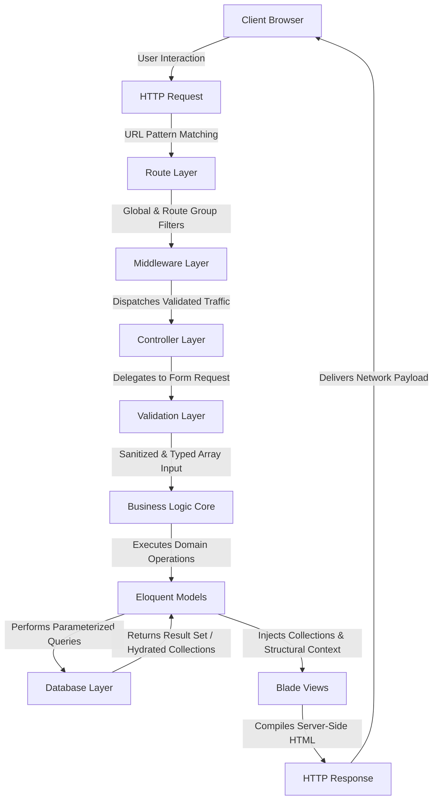
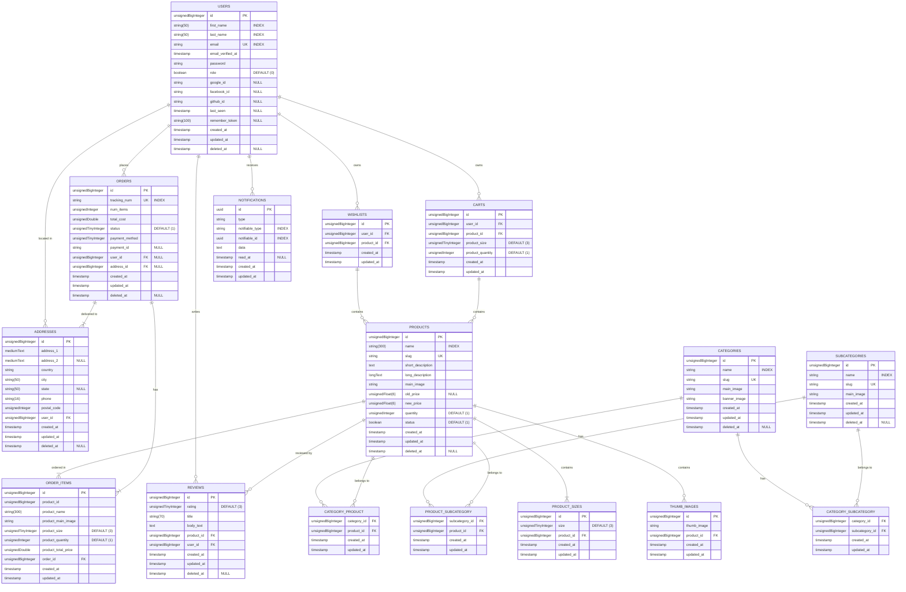

<div align="center">

# race
### A Modern, Secure, and Scalable Fashion E-Commerce Platform

<p align="center">

A full-featured online fashion store built with Laravel 9, designed using modern software engineering principles to deliver a secure, scalable, high-performance, and maintainable shopping experience.

Secure • Scalable • Modular • High Performance

</p>

---


</div>

---

# Table of Contents

- [Introduction](#introduction)
- [Business Problem](#business-problem)
- [Project Vision](#project-vision)
- [Objectives](#objectives)
- [Key Features](#key-features)
- [Screenshots](#screenshots)
- [Technology Stack](#technology-stack)
- [System Architecture](#system-architecture)
- [Database ERD](#database-erd)
- [Project Structure](#project-structure)
- [Installation](#installation)
- [Configuration](#configuration)
- [Running the Project](#running-the-project)
- [Documentation](#documentation)
- [Security Highlights](#security-highlights)
- [Performance Optimizations](#performance-optimizations)
- [Future Improvements](#future-improvements)
- [Visit the Store](#visit-the-store)

---

# Introduction

Grace is a modern fashion e-commerce platform developed with **Laravel 9**, following enterprise-level software engineering principles and modern architectural practices.

The platform is designed to provide customers with a seamless shopping experience while offering administrators a powerful dashboard for managing products, categories, users, orders, reviews, notifications, and other business operations.

Unlike traditional academic CRUD projects, Grace has been engineered with a strong emphasis on maintainability, scalability, code reusability, performance optimization, and security.

The application combines a clean user experience with a modular backend architecture, allowing new features to be integrated with minimal changes to the existing codebase.

---

# Business Problem

Many online clothing stores focus primarily on displaying products while overlooking essential aspects such as maintainability, performance, and user experience.

Grace addresses these challenges by providing a comprehensive platform that offers:

- A structured product catalog
- Secure online payments
- Flexible order management
- Personalized shopping experience
- Powerful administration tools
- Efficient product discovery
- High-performance browsing
- Secure customer authentication

The platform aims to bridge the gap between elegant user interfaces and robust backend architecture.

---

# Project Vision

The vision behind Grace is to build a complete fashion marketplace that combines modern web technologies with clean software architecture.

Rather than being just another online store, the project demonstrates how enterprise software engineering principles can be applied to Laravel applications to produce a scalable and maintainable system suitable for real-world deployment.

---

# Objectives

Grace has been developed with several primary objectives:

- Deliver a modern online shopping experience.
- Provide an intuitive administrative dashboard.
- Maintain a modular and reusable codebase.
- Support secure online transactions.
- Ensure high application performance.
- Reduce code duplication through reusable components.
- Simplify future maintenance and scalability.
- Demonstrate clean Laravel architecture and best practices.

---

# Key Features

## Customer Features

- User Registration
- Secure Login
- Social Authentication
    - Google
    - Facebook
    - GitHub
- Password Recovery
- User Profile Management
- Address Management
- Wishlist
- Shopping Cart
- Product Search
- Advanced Product Filtering
- Product Reviews
- Product Ratings
- Order Tracking
- Stripe Payment Gateway
- Cash on Delivery
- Notifications
- Responsive User Interface

---

## Product Management

- Product Categories
- Product Collections
- Multiple Product Images
- Multiple Product Sizes
- Product Variants
- Inventory Management
- Soft Delete Support
- Image Optimization
- Product Search
- Dynamic Filtering

---

## Administration Panel

The administration dashboard provides centralized management for the entire platform.

Main modules include:

- Dashboard
- Categories
- Subcategories
- Products
- Customers
- Orders
- Reviews
- User Addresses
- Notifications
- Search
- Filtering

Each module follows a unified CRUD architecture that significantly reduces repetitive code and improves maintainability.

---

# Screenshots

| Home                                    | Products                                    |
|-----------------------------------------|---------------------------------------------|
|  |  |

| Product                                            | Cart                                    |
|----------------------------------------------------|-----------------------------------------|
|  |  |

| Checkout                                    | Dashboard                                    |
|---------------------------------------------|----------------------------------------------|
|  |  |

---

# Technology Stack

## Backend

- Laravel 9
- PHP 8.2
- MySQL
- Eloquent ORM

### *Backend Third-Party Services

- Stripe
- Laravel Socialite
- Google OAuth
- Facebook OAuth
- GitHub OAuth

## Frontend

- Blade Templates
- MDBootstrap 4
- JavaScript
- jQuery
- AJAX

### *Frontend Third-Party Services

- Font Awesome
- Themify Icons
- Owl Carousel 2
- Sweet Alert 2
- aksFileUpload
- Filter Multiselect
- libphonenumber
- Tiny MCE

## Development Tools

- Composer
- NPM
- Laravel Mix
- Guzzle HTTP Client

## Performance Tools

- Fast Pagination
- Redis Support
- Laravel Cache
- Optimized Asset Pipeline
---

# System Architecture

Grace follows Laravel's MVC architecture while extending it with additional abstraction layers to improve maintainability, reusability, scalability, and consistency across the entire application.

The application separates responsibilities into well-defined modules, ensuring that each layer focuses on a single responsibility while remaining loosely coupled with the rest of the system.



### Architectural Highlights

- Modular MVC Architecture
- Reusable Blade Components
- Standardized Constants Layer
- Helper-Based Business Utilities
- Custom Blade Directives
- Custom Artisan Commands
- Service Provider Extensions
- Modular Route Organization
- Soft Delete Strategy
- Centralized Configuration
- Localization Support
- Reusable CRUD Components

The architecture has been designed to simplify future expansion while minimizing code duplication.

---

# Database ERD


---

# Project Structure

The project is organized into clearly separated modules, allowing developers to quickly understand and navigate the codebase.

```text
📂 app/
│
├── 📂 Console/
│   └── 📂 Commands/
├── 📂 Contracts/
├── 📂 Exceptions/
├── 📂 Helpers/
├── 📂 Http/
│   ├── 📂 Controllers/
│   ├── 📂 Middleware/
│   └── 📂 Requests/
├── 📂 Mail/
├── 📂 Models/
├── 📂 Notifications/
├── 📂 Providers/
├── 📂 Services/
└── 📂 Traits/

📂 bootstrap/

📂 config/

📂 database/
└── 📂 migrations/

📂 lang/

📂 public/
│
├── 📂 assets/
├── 📂 css/
├── 📂 icons/
├── 📂 js/
├── 📂 sounds/
└── 📂 storage/

📂 resources/
│
├── 📂 css/
├── 📂 js/
└── 📂 views/

📂 routes/
│
├── 📂 admin/
├── 📂 auth/
└── 📂 guest/

📂 storage/

📂 tests/
```

Each directory has a dedicated responsibility, promoting a clean separation of concerns and simplifying long-term maintenance.

---

# Installation

## Clone the Repository

```bash
git clone https://github.com/your-username/grace.git
```

---

## Navigate into the Project

```bash
cd grace
```

---

## Install PHP Dependencies

```bash
composer install
```

---

## Install JavaScript Dependencies

```bash
npm install
```

---

## Copy Environment File

```bash
cp .env.example .env
```

---

## Generate Application Key

```bash
php artisan key:generate
```

---

## Configure Database

Update your `.env` file.

```env
DB_CONNECTION=mysql
DB_HOST=127.0.0.1
DB_PORT=3306
DB_DATABASE=grace
DB_USERNAME=root
DB_PASSWORD=
```

---

## Run Migrations

```bash
php artisan migrate
```

---

## Seed the Database (Optional)

```bash
php artisan db:seed
```

---

## Build Frontend Assets

Development

```bash
npm run dev
```

Production

```bash
npm run production
```

---

## Start the Development Server

```bash
php artisan serve
```

---

# Configuration

Grace supports environment-based configuration for all major services.

Examples include:

- Database
- Mail
- Cache
- Session
- Filesystem
- Queue
- Stripe Payment Gateway
- Social Login Providers
- Redis
- Logging

No sensitive credentials are stored directly inside the source code.

---

# Running the Project

After completing the installation steps, the application will be available at:

```
http://127.0.0.1:8000
```

From there, users can:

- Browse products
- Create accounts
- Place orders
- Manage wishlists
- Write reviews
- Complete payments
- Track orders

Administrators can access the dashboard to manage every aspect of the platform.

---

# Documentation

The project documentation is divided into specialized documents for easier navigation.

```text
docs/

01-project-overview.md

02-system-architecture.md

03-features.md

04-folder-structure.md

05-database-design.md

06-security.md

07-performance.md

08-installation.md

09-deployment.md

10-development-methodology.md

11-project-workflow.md

12-routing-and-application-flow.md

13-future-enhancements.md
```

Each document focuses on one aspect of the project, making the documentation easier to maintain and extend.

---

# Security Highlights

Security has been considered throughout the development lifecycle.

Implemented security measures include:

- Authentication
- Authorization
- Route Protection
- Middleware-Based Access Control
- CSRF Protection
- SQL Injection Protection
- XSS Protection
- Request Validation
- Password Hashing
- Secure Sessions
- Remember Me Authentication
- Social Login Authentication
- Secure Stripe Integration
- Environment-Based Secrets Management
- Input Sanitization
- Secure File Upload Handling
- Soft Delete Strategy
- Error Handling

These mechanisms work together to provide a secure shopping experience for both customers and administrators.

---

# Performance Optimizations

Grace incorporates multiple optimization strategies to improve responsiveness and scalability.

### Backend

- Optimized Eloquent Queries
- Fast Pagination
- Redis Support
- Application Caching
- Route Caching
- Configuration Caching
- Optimized Composer Autoload

### Frontend

- AJAX-Based Interactions
- Asset Minification
- Optimized Images
- Lazy Loading Strategies
- Responsive Design

### Architecture

- Reusable Components
- Modular Organization
- Helper Functions
- Reduced Code Duplication
- Centralized Configuration

---

# Future Improvements

Potential future enhancements include:

- Multi-language Support
- Product Recommendation Engine
- AI-Powered Search
- Real-Time Notifications
- Multi-Vendor Marketplace
- Coupon & Discount Engine
- Loyalty Points System
- REST API
- Mobile Application
- Docker Support
- CI/CD Pipeline
- Automated Testing Suite

---

# Visit the Store


---

# License

This project is licensed under the MIT License.

See the LICENSE file for more information.

---

# Author

**Yousif Ayman Ahmed Mohamed**

Full Stack Web Developer & Teaching Assistant at the Faculty of Computers & Information Technology (EELU)

---

# Acknowledgments

Special thanks to the Laravel community and all open-source contributors whose tools, libraries, and best practices helped shape this project.

---

<div align="center">

Grace

Built with Laravel ❤️ © 2026

⭐ If you found this project useful, consider giving it a star on GitHub!

</div>
