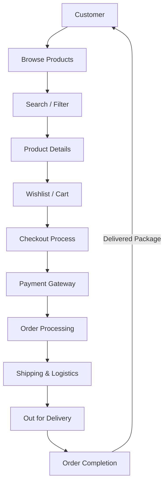

# Grace

> **A Modern Fashion E-Commerce Platform Built with Laravel 9**

---

# Table of Contents

- [Introduction](#introduction)
- [Business Background](#business-background)
- [Business Problem](#business-problem)
- [Solution](#solution)
- [Project Vision](#project-vision)
- [Project Mission](#project-mission)
- [Project Objectives](#project-objectives)
- [Target Audience](#target-audience)
- [Core Business Features](#core-business-features)
- [Business Workflow](#business-workflow)
- [Why Grace?](#why-grace)
- [Screenshots](#screenshots)
- [Project Scope](#project-scope)
- [System Modules](#system-modules)
- [Design Philosophy](#design-philosophy)

---

# Introduction

Grace is a full-featured online fashion e-commerce platform developed using **Laravel 9** and modern web technologies. The platform provides customers with a seamless shopping experience while equipping administrators with a comprehensive dashboard to efficiently manage products, users, orders, reviews, notifications, and other core business operations.

The application has been engineered with a strong focus on **clean architecture**, **security**, **performance**, **maintainability**, and **scalability**, making it suitable as a production-ready foundation for modern e-commerce solutions.

Rather than being a simple online catalog, Grace demonstrates how enterprise software engineering principles can be applied to build a robust Laravel application that is easy to extend, maintain, and evolve over time.

---

# Business Background

The fashion industry has rapidly shifted toward digital commerce, where customers expect fast browsing, secure online payments, personalized shopping experiences, and intuitive interfaces.

Many existing online stores primarily focus on displaying products while neglecting aspects such as software maintainability, security, scalability, and administrative efficiency.

Grace was designed to bridge this gap by combining a modern shopping experience with a well-structured backend architecture capable of supporting long-term business growth.

---

# Business Problem

Customers often face several challenges when shopping online, including:

- Difficulty finding products quickly.
- Poor product categorization.
- Complicated checkout processes.
- Limited payment options.
- Inconsistent user experience.
- Slow application performance.
- Lack of trust in online payment systems.

Store owners face different challenges:

- Managing large product catalogs.
- Tracking customer orders.
- Handling product reviews.
- Organizing categories.
- Managing inventory.
- Monitoring customer activity.
- Maintaining a scalable codebase.

Grace addresses both perspectives through a unified platform designed for customers and administrators alike.

---

# Solution

Grace provides an integrated solution that combines product management, customer management, order processing, secure payments, review management, and administrative tools into one centralized platform.

The system emphasizes:

- Clean user experience.
- Organized product catalog.
- Efficient search and filtering.
- Secure checkout.
- Flexible order lifecycle.
- High code quality.
- Modular software architecture.

---

# Project Vision

To build a modern, secure, scalable, and maintainable fashion e-commerce platform that demonstrates industry-standard software engineering practices while delivering an exceptional shopping experience.

---

# Project Mission

The mission of Grace is to simplify online fashion shopping by combining elegant user interfaces with reliable backend services, allowing both customers and administrators to interact with the platform efficiently and securely.

---

# Project Objectives

The primary objectives of the project include:

- Deliver a complete online shopping solution.
- Build a highly maintainable Laravel application.
- Minimize code duplication.
- Maximize code reusability.
- Improve application scalability.
- Ensure strong security practices.
- Optimize application performance.
- Simplify future development.
- Demonstrate professional software engineering techniques.

---

# Target Audience

Grace serves three primary user groups.

## Customers

Customers can:

- Browse products.
- Search products.
- Filter products.
- Create wishlists.
- Manage shopping carts.
- Place online orders.
- Track order status.
- Review purchased products.
- Manage delivery addresses.

---

## Store Administrators

Administrators can manage:

- Categories
- Subcategories
- Products
- Product Images
- Product Sizes
- Orders
- Customers
- Reviews
- Notifications

They also have full control over the shopping platform through an administrative dashboard.

---

## Developers

Grace also serves as an educational and professional reference project for Laravel developers interested in:

- Clean Architecture
- Software Design Principles
- Laravel Best Practices
- Scalable Project Organization
- Reusable Components

---

# Core Business Features

The platform provides several business capabilities, including:

- Product Catalog Management
- Customer Account Management
- Wishlist Management
- Shopping Cart
- Secure Checkout
- Stripe Payments
- Cash on Delivery
- Product Reviews
- Product Ratings
- Order Tracking
- Notification System
- Search Engine
- Advanced Product Filtering
- Responsive User Interface
- Secure Authentication

---

# Business Workflow

The overall shopping process follows a straightforward workflow.

Each stage has been designed to minimize friction while ensuring a secure and reliable purchasing experience.

---

# Why Grace?

Grace is more than a traditional Laravel CRUD application.

It has been engineered around several architectural principles that improve software quality and long-term maintainability.

These include:

- Modular Architecture
- Reusable Components
- Centralized Configuration
- Standardized Constants
- Custom Helper Utilities
- Organized Route Structure
- Optimized Database Design
- Secure Authentication
- Performance-Oriented Development

These engineering decisions make the project easier to extend and maintain compared to conventional Laravel applications.

---

# Screenshots

| Home                                       | Products                                       |
|--------------------------------------------|------------------------------------------------|
|  |  |

| Product                                               | Cart                                        |
|-------------------------------------------------------|---------------------------------------------|
|  |   |

| Checkout                                       | Dashboard                                       |
|------------------------------------------------|-------------------------------------------------|
|  |  |

---

# Project Scope

Grace covers all essential operations required for a medium-scale fashion e-commerce platform.

The current scope includes:

- User Management
- Product Management
- Category Management
- Shopping Experience
- Checkout Process
- Order Management
- Review System
- Payment Processing
- Administration Dashboard

Future enhancements can be integrated without major architectural changes due to the modular structure of the application.

---

# System Modules

The application consists of multiple interconnected modules.

- Authentication Module
- User Management Module
- Product Management Module
- Category Management Module
- Wishlist Module
- Shopping Cart Module
- Checkout Module
- Payment Module
- Order Module
- Review Module
- Notification Module
- Administration Module

Each module follows Laravel's MVC architecture while sharing reusable infrastructure components throughout the application.

---

# Design Philosophy

Grace has been developed following modern software engineering principles.

The overall philosophy emphasizes:

- Simplicity over complexity.
- Reusability over duplication.
- Maintainability over shortcuts.
- Security by design.
- Scalability from the beginning.
- Consistent coding standards.
- Modular architecture.
- Separation of concerns.

These principles collectively contribute to a codebase that remains organized, extensible, and production-ready as the application grows.

---

# What's Next?

Continue reading:

➡ **02-system-architecture.md**
