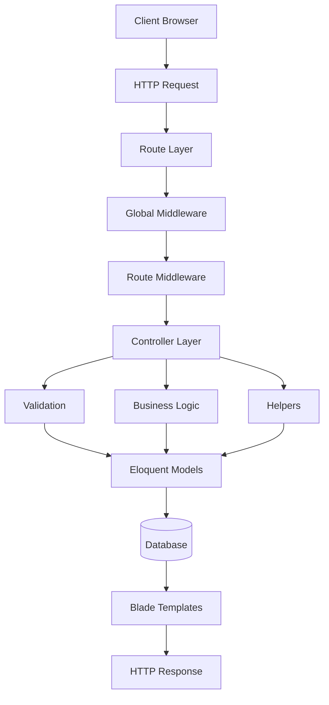

# System Architecture

---

# Table of Contents

- [Architecture Overview](#architecture-overview)
- [Design Philosophy](#design-philosophy)
- [High-Level Architecture](#high-level-architecture)
- [Request Lifecycle](#request-lifecycle)
- [Layered Architecture](#layered-architecture)
- [Core Architectural Components](#core-architectural-components)
- [Module Interaction](#module-interaction)
- [Configuration Strategy](#configuration-strategy)
- [Extensibility](#extensibility)
- [Architectural Benefits](#architectural-benefits)

---

# Architecture Overview

Grace follows Laravel's Model-View-Controller (MVC) architecture while introducing several custom abstraction layers to improve maintainability, consistency, scalability, and developer productivity.

Instead of relying exclusively on Laravel's default conventions, the application extends the framework with reusable infrastructure components that standardize development across the entire project.

The architecture emphasizes:

- Loose coupling
- High cohesion
- Reusability
- Separation of concerns
- Centralized configuration
- Consistent naming conventions
- Modular design

This allows new modules to be introduced with minimal impact on existing functionality.

---

# Design Philosophy

The application's architecture is built around one central idea:

> **Write reusable code once, then use it everywhere.**

To achieve this objective, repetitive logic has been abstracted into reusable components rather than duplicated throughout controllers and views.

Whenever a common pattern appears more than once, it is typically extracted into a helper, trait, reusable component, or centralized standard.

This approach significantly reduces maintenance effort while improving code readability and long-term scalability.

---

# High-Level Architecture



Each layer has a single responsibility and communicates with neighboring layers through well-defined interfaces.

---

# Request Lifecycle

A typical request follows these stages:

1. The browser sends an HTTP request.
2. Laravel matches the request with the appropriate route.
3. Global middleware executes.
4. Route-specific middleware performs authorization and request filtering.
5. The request reaches the responsible controller.
6. Validation rules verify incoming data.
7. Business logic executes.
8. Models communicate with the database.
9. The controller prepares the response.
10. Blade templates generate the final HTML.
11. The response is returned to the client.

This workflow ensures that validation, authorization, and business logic remain properly separated.

---

# Layered Architecture

Grace extends Laravel's default architecture with multiple reusable layers.

## Presentation Layer

Responsible for user interaction.

Includes:

- Blade Views
- Blade Components
- Layouts
- Partials
- JavaScript
- CSS
- Bootstrap
- AJAX

This layer focuses exclusively on presentation without embedding business logic.

---

## Routing Layer

The routing layer defines the application's endpoints.

Routes are organized by feature to improve readability and maintainability.

Middleware is attached where necessary to protect administrative functionality and authenticated resources.

---

## Controller Layer

Controllers coordinate requests without becoming overloaded.

Responsibilities include:

- Receiving validated requests
- Coordinating application flow
- Calling helper utilities
- Preparing responses
- Returning views or redirects

Controllers intentionally avoid containing excessive business logic.

---

## Validation Layer

Incoming requests are validated before business operations execute.

This ensures:

- Data consistency
- Security
- Clean controller code

Validation also provides meaningful feedback to end users.

---

## Business Layer

The business layer contains reusable operations shared across different modules.

Instead of duplicating logic throughout controllers, common functionality is centralized into reusable infrastructure.

Examples include:

- CRUD utilities
- Route helpers
- Image processing
- Cache management
- File handling
- Notification helpers
- Shared business operations

---

## Data Layer

The data layer consists of:

- Eloquent Models
- Relationships
- Query Scopes
- Soft Deletes
- Migrations
- Factories
- Seeders

It represents the persistent state of the application while abstracting database interactions.

---

# Core Architectural Components

Grace introduces several custom architectural building blocks.

## Standards Layer

One of the most distinctive aspects of the project is the centralized standards layer.

Rather than scattering literal strings and repeated identifiers throughout the application, commonly used values are defined once and reused everywhere.

Examples include:

- Route names
- View names
- Table names
- Model names
- Cache keys
- Validation constants
- CRUD identifiers
- Database attributes
- Foreign keys
- Component names

This promotes consistency while reducing maintenance costs.

---

## Helper Layer

A significant amount of reusable functionality has been extracted into helper functions.

These helpers simplify repetitive tasks such as:

- CRUD operations
- Cache invalidation
- File management
- Route generation
- Image handling
- Collection processing
- Utility operations

This results in cleaner controllers and more maintainable code.

---

## Traits

Traits encapsulate reusable behaviors shared between multiple classes.

Rather than duplicating methods across controllers or models, shared functionality is composed through traits where appropriate.

---

## Service Providers

Service providers extend Laravel's service container during the application's bootstrap process.

They are responsible for registering custom services, macros, directives, and project-specific functionality.

This keeps framework customization centralized and organized.

---

## Blade Components

Reusable Blade components provide consistent UI elements across the application.

Benefits include:

- Reduced duplication
- Consistent design
- Easier maintenance
- Cleaner templates

---

## Custom Blade Directives

The project extends Blade with custom directives that simplify repetitive template logic while improving readability.

---

## Artisan Commands

Custom Artisan commands automate project-specific development tasks, reducing manual work and improving developer productivity.

---

# Module Interaction

Application modules communicate through well-defined interfaces rather than tightly coupled implementations.

For example:

```mermaid
flowchart TD

Product&nbsp;Module
        │
        ▼
Category&nbsp;Module

        │
        ▼
Order&nbsp;Module

        │
        ▼
Notification&nbsp;Module

        │
        ▼
User&nbsp;Module
```

Each module focuses on its own responsibility while interacting with others only when necessary.

---

# Configuration Strategy

Configuration values are centralized within Laravel's configuration system and environment variables.

This approach allows deployment-specific values to be changed without modifying application code.

Examples include:

- Database credentials
- Payment gateways
- Mail services
- Social authentication providers
- Session drivers
- Cache drivers
- Queue configuration

---

# Extensibility

The architecture has been intentionally designed for future expansion.

Examples include:

- New authentication providers
- Additional payment gateways
- New product modules
- Loyalty systems
- Coupons
- REST APIs
- Mobile applications

Most future enhancements can be introduced without major architectural restructuring.

---

# Architectural Benefits

The architecture provides several long-term advantages.

- High maintainability
- Strong modularity
- Excellent code reuse
- Reduced duplication
- Easier onboarding for new developers
- Cleaner project organization
- Better scalability
- Improved testability
- Consistent development standards

Collectively, these characteristics make Grace significantly easier to evolve than a conventional Laravel application that relies solely on framework defaults.

---

# Continue Reading

➡ **03-features.md**
