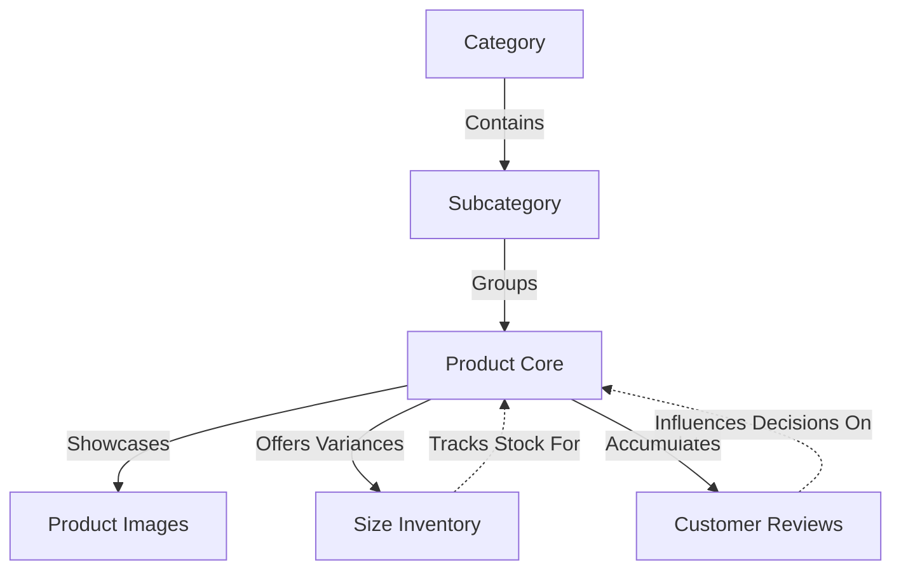
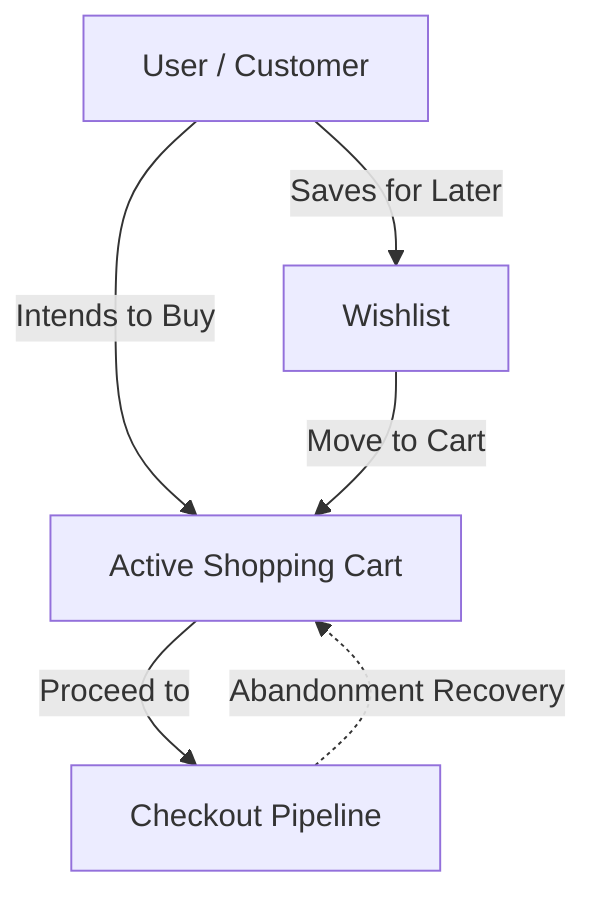
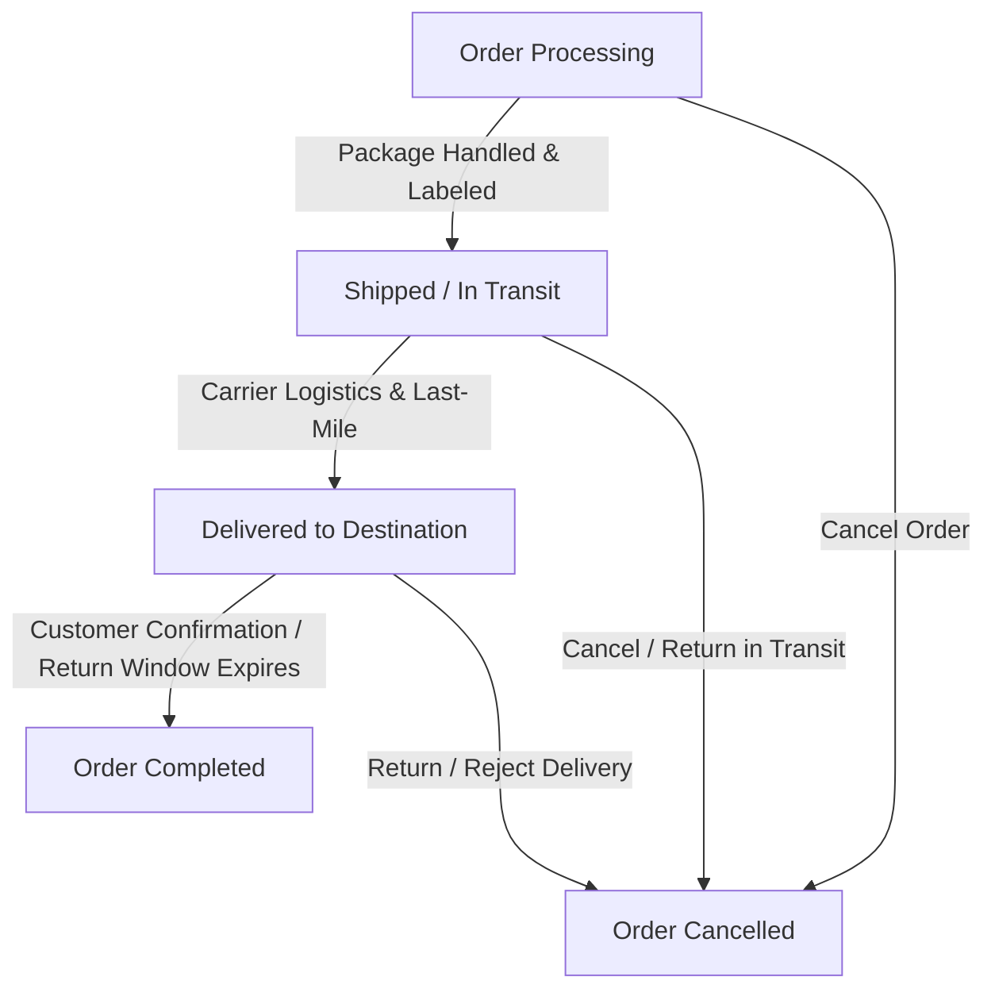

# Database Design

---

# Table of Contents

- [Overview](#overview)
- [Database Philosophy](#database-philosophy)
- [Entity Relationship Overview](#entity-relationship-overview)
- [Core Entities](#core-entities)
- [Product Domain](#product-domain)
- [Customer Domain](#customer-domain)
- [Shopping Domain](#shopping-domain)
- [Order Domain](#order-domain)
- [Review Domain](#review-domain)
- [Notification Domain](#notification-domain)
- [Relationship Design](#relationship-design)
- [Data Integrity](#data-integrity)
- [Soft Delete Strategy](#soft-delete-strategy)
- [Database Optimization](#database-optimization)
- [Scalability Considerations](#scalability-considerations)
- [Database Strengths](#database-strengths)

---

# Overview

Grace uses a relational database powered by **MySQL** and managed through Laravel's **Eloquent ORM**.

The database has been carefully designed to represent the business domain of a modern fashion e-commerce platform while maintaining data consistency, flexibility, and scalability.

Instead of storing everything inside a few large tables, the data model separates responsibilities into specialized entities connected through well-defined relationships.

This normalization reduces redundancy while improving maintainability and query efficiency.

---

# Database Philosophy

The database follows several important design principles.

- Data Normalization
- Referential Integrity
- Reusable Relationships
- Flexible Product Structure
- Business-Oriented Entity Design
- Soft Deletion
- Scalable Relationships

Every table represents a single business concept.

This approach minimizes duplicated information while making future enhancements easier to implement.

---

# Entity Relationship Overview

The database consists of several business domains.

```text
Users
│
├── Addresses
├── Wishlists
├── Carts
├── Checkout
├── Orders
├── Reviews
└── Notifications

Products
│
├── Images
├── Sizes
├── Reviews
└── Categories

Orders
│
├── Order Items
└── Payment Information

Categories & Subcategories
└── Products
```

Each domain remains independent while communicating through foreign-key relationships.

---

# Core Entities

The application revolves around several primary entities.

## User

Represents every registered customer or administrator.

Responsibilities include:

- Authentication
- Profile Information
- Address Management
- Orders
- Wishlist
- Cart
- Checkout
- Reviews
- Notifications

---

## Product

Represents an item available for purchase.

A product stores:

- Name
- Description
- Collection
- Price
- Stock
- Images
- Sizes
- Category
- Reviews

Products are intentionally separated from their images and sizes to maintain a flexible structure.

---

## Category

Categories organize products into major groups.

Current categories include:

- Men
- Women
- Kids

Each category may contain multiple subcategories.

---

## Subcategory

Subcategories provide more detailed product classification.

Examples include:

- Jackets
- Sweaters & Shirts
- Pants
- Shoes
- Bags
- Accessories

This hierarchy improves navigation and product discovery.

---

# Product Domain

The product domain is one of the largest parts of the application.

It consists of several interconnected entities.



This modular structure allows products to evolve independently without modifying unrelated tables.

---

# Customer Domain

Customers interact with several independent entities.

```text
User

├── Addresses

├── Wishlist

├── Cart

├── Orders

├── Reviews

└── Notifications
```

Separating these entities keeps the user table lightweight while allowing unlimited expansion.

---

# Shopping Domain

Shopping operations are intentionally separated into dedicated entities.



Each stage of the shopping journey has a dedicated responsibility.

This separation simplifies future enhancements such as discount engines or abandoned cart recovery.

---

# Order Domain

Orders represent the business transaction between customers and the store.

Each order contains:

- Customer
- Shipping Address
- Payment Method
- Order Status
- Order Items
- Total Price

The order lifecycle follows a predefined workflow.



---

# Review Domain

Reviews connect customers with purchased products.

Each review stores:

- Rating
- Review Content
- Author
- Product

This relationship enables customers to share purchasing experiences while helping future buyers make informed decisions.

---

# Notification Domain

Notifications inform users about important events throughout the application.

Examples include:

- Order Updates
- Account Events
- Administrative Messages

Separating notifications into their own entity simplifies future expansion toward real-time communication.

---

# Relationship Design

Grace uses several relationship types.

## One-to-Many

Examples include:

- Category → Products
- Product → Images
- Product → Sizes
- User → Orders
- User → Reviews
- User → Addresses

---

## Many-to-Many

Many-to-many relationships are implemented through pivot tables where appropriate.

This design allows entities to remain independent while supporting flexible associations.

---

# Data Integrity

The database emphasizes consistency through:

- Primary Keys
- Foreign Keys
- Unique Constraints
- Cascading Relationships
- Validation Rules
- Controlled Deletion

These mechanisms help prevent invalid or orphaned data.

---

# Soft Delete Strategy

Several entities support soft deletion.

Instead of permanently removing records, deleted data remains recoverable.

Benefits include:

- Data Recovery
- Audit Capability
- Safer Administration
- Reduced Risk of Accidental Data Loss

Permanent deletion remains available only when explicitly required.

---

# Database Optimization

Several optimization techniques improve database performance.

These include:

- Indexed Relationships
- Optimized Foreign Keys
- Normalized Tables
- Smaller Entity Size
- Efficient Joins
- Optimized Eloquent Relationships

Together these practices contribute to faster queries and lower storage redundancy.

---

# Scalability Considerations

The schema has been designed with future growth in mind.

Possible future enhancements include:

- Coupons
- Product Variants
- Warehouses
- Inventory Tracking
- Multiple Vendors
- Loyalty Programs
- Product Recommendations
- Inventory Reservations
- Analytics

These additions can be introduced with minimal disruption to the existing schema due to the modular design.

---

# Database Strengths

The current database design provides:

- High normalization
- Clear business boundaries
- Strong data integrity
- Excellent maintainability
- Flexible product management
- Efficient relationship modeling
- Scalable architecture
- Easy future expansion

Rather than focusing solely on storing data, the schema has been designed to accurately model the real-world business processes of an online fashion store.

---

# Continue Reading

➡ **06-security.md**
