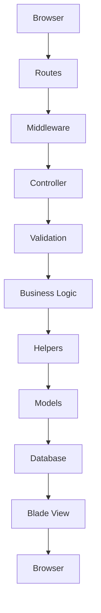
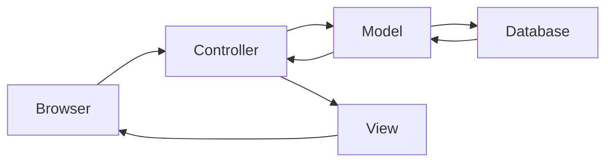
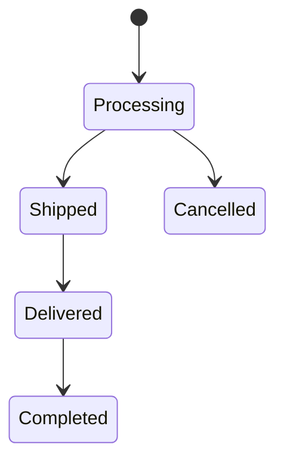
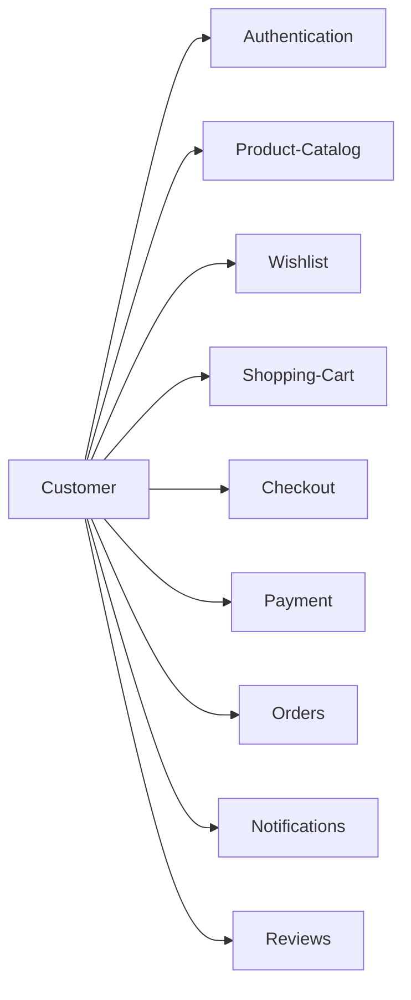

# Project Workflow

---

# Table of Contents

- [Overview](#overview)
- [Request Lifecycle](#request-lifecycle)
- [MVC Workflow](#mvc-workflow)
- [Authentication Workflow](#authentication-workflow)
- [Shopping Workflow](#shopping-workflow)
- [Order Workflow](#order-workflow)
- [Payment Workflow](#payment-workflow)
- [Review Workflow](#review-workflow)
- [Notification Workflow](#notification-workflow)
- [Cache Workflow](#cache-workflow)
- [Error Handling Workflow](#error-handling-workflow)
- [Overall System Workflow](#overall-system-workflow)
- [Summary](#summary)

---

# Overview

Grace is built around Laravel's request lifecycle while extending it with reusable infrastructure, helper utilities, middleware, caching, and modular business components.

Every user action follows a predictable execution flow that keeps responsibilities separated and simplifies maintenance.

The following sections explain how requests travel through the application.

---

# Request Lifecycle

Every HTTP request follows the same high-level lifecycle.



This workflow demonstrates the separation between presentation, business logic, and persistence.

---

# MVC Workflow

Grace follows Laravel's Model-View-Controller architecture.



Each layer has a dedicated responsibility.

| Layer      | Responsibility                             |
|------------|--------------------------------------------|
| Model      | Business entities and database interaction |
| View       | User interface                             |
| Controller | Request coordination                       |

---

# Authentication Workflow

The authentication process verifies user identity before granting access to protected resources.

```mermaid
flowchart TD

User

↓

Login&nbsp;Form

↓

Validation

↓

Authentication

↓

Session&nbsp;Creation

↓

Dashboard&nbsp;/&nbsp;Home

↓

Logout

↓

Session&nbsp;Destroyed
```

Supported authentication methods include:

- Email & Password
- Google OAuth
- Facebook OAuth
- GitHub OAuth

---

# Shopping Workflow

The shopping experience represents the primary business workflow.

```mermaid
flowchart TD

Browse&nbsp;Products

↓

Product&nbsp;Details

↓

Select&nbsp;Size

↓

Add&nbsp;To&nbsp;Cart

↓

Shopping&nbsp;Cart

↓

Checkout

↓

Payment

↓

Order&nbsp;Created
```

This flow minimizes unnecessary steps while providing a familiar purchasing experience.

---

# Order Workflow

Orders progress through several business states.



Each status represents a real business milestone during order fulfillment.

---

# Payment Workflow

Grace currently supports two payment methods.

```mermaid
flowchart TD

Checkout

↓

Choose&nbsp;Payment

↓

Stripe

OR

Cash&nbsp;On&nbsp;Delivery

↓

Payment&nbsp;Confirmation

↓

Create&nbsp;Order

↓

Notification
```

Stripe securely processes online transactions, while Cash on Delivery supports customers who prefer offline payment.

---

# Review Workflow

Product reviews help improve customer confidence.

```mermaid
flowchart TD

Delivered&nbsp;Product

↓

Customer

↓

Write&nbsp;Review

↓

Validation

↓

Store&nbsp;Review

↓

Product&nbsp;Rating&nbsp;Updated
```

Only validated review data is persisted.

---

# Notification Workflow

Notifications keep customers informed throughout their shopping journey.

```mermaid
flowchart TD

Business&nbsp;Event

↓

Notification&nbsp;Created

↓

Store&nbsp;Notification

↓

Display&nbsp;To&nbsp;User
```

Typical events include:

- Order updates
- Administrative messages
- Account notifications

---

# Cache Workflow

Grace reduces unnecessary database operations through caching.

```mermaid
flowchart TD

Request

↓

Cache&nbsp;Exists?

Yes --> Return&nbsp;Cached&nbsp;Data

No --> Query&nbsp;Database

↓

Store&nbsp;Cache

↓

Return&nbsp;Response
```

This approach significantly improves application responsiveness.

---

# Error Handling Workflow

Unexpected errors are handled gracefully.

```mermaid
flowchart TD

Exception

↓

Laravel&nbsp;Exception&nbsp;Handler

↓

Log&nbsp;Error

↓

Generate&nbsp;User-Friendly&nbsp;Response

↓

Return&nbsp;Response
```

Internal implementation details remain hidden from end users.

---

# Overall System Workflow

The following diagram summarizes the interaction between the major application modules.



Although each module operates independently, together they form a complete e-commerce workflow.

---

# Summary

Grace is organized around a modular request lifecycle where every component has a clearly defined responsibility.

By combining Laravel's MVC architecture with middleware, validation, reusable helpers, caching, Eloquent models, and Blade templates, the application maintains a clean execution flow that is easy to understand, extend, and maintain.

The documented workflows demonstrate not only how individual features operate but also how the different modules collaborate to deliver a complete online shopping experience.

---

# Continue Reading

➡ **12-routing-and-application-flow.md**
