# Project Workflow

---

# Table of Contents

- [Overview](#overview)
- [Request Lifecycle](#request-lifecycle)
- [MVC Workflow](#mvc-workflow)
- [Authentication Workflow](#authentication-workflow)
- [Shopping Workflow](#shopping-workflow)
- [Order Workflow](#order-workflow)
- [Payment Workflow](#payment-workflow)
- [Review Workflow](#review-workflow)
- [Notification Workflow](#notification-workflow)
- [Cache Workflow](#cache-workflow)
- [Error Handling Workflow](#error-handling-workflow)
- [Overall System Workflow](#overall-system-workflow)
- [Summary](#summary)

---

# Overview

Grace is built around Laravel's request lifecycle while extending it with reusable infrastructure, helper utilities, middleware, caching, and modular business components.

Every user action follows a predictable execution flow that keeps responsibilities separated and simplifies maintenance.

The following sections explain how requests travel through the application.

---

# Request Lifecycle

Every HTTP request follows the same high-level lifecycle.

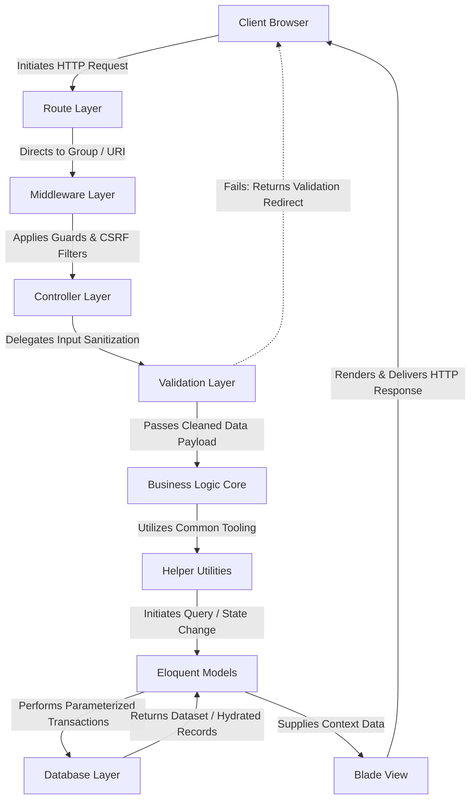

This workflow demonstrates the separation between presentation, business logic, and persistence.

---

# MVC Workflow

Grace follows Laravel's Model-View-Controller architecture.

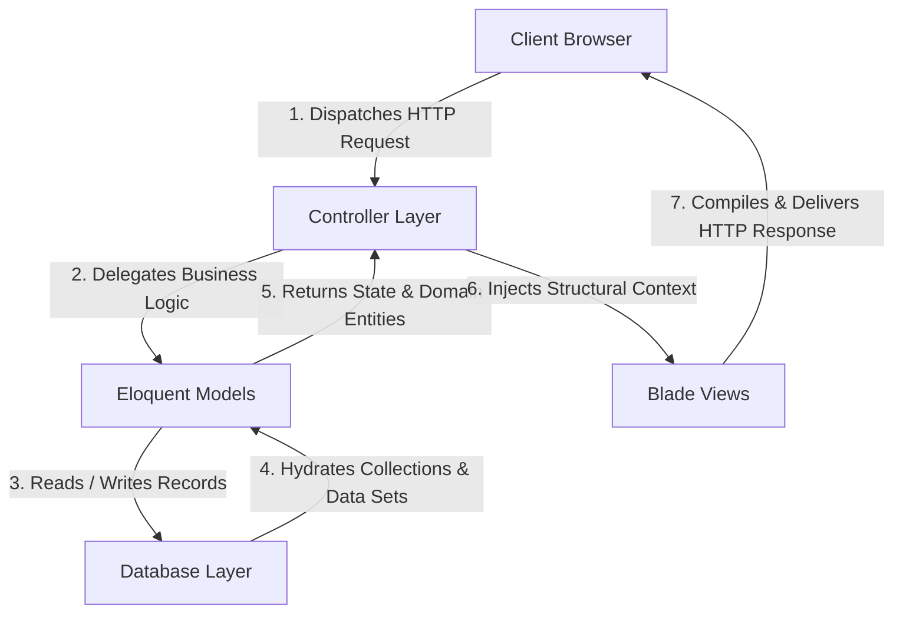

Each layer has a dedicated responsibility.

| Layer      | Responsibility                             |
|------------|--------------------------------------------|
| Model      | Business entities and database interaction |
| View       | User interface                             |
| Controller | Request coordination                       |

---

# Authentication Workflow

The authentication process verifies user identity before granting access to protected resources.

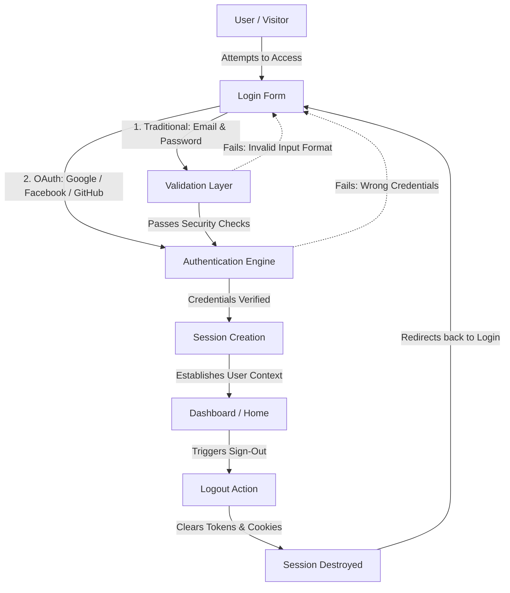

Supported authentication methods include:

- Email & Password
- Google OAuth
- Facebook OAuth
- GitHub OAuth

---

# Shopping Workflow

The shopping experience represents the primary business workflow.

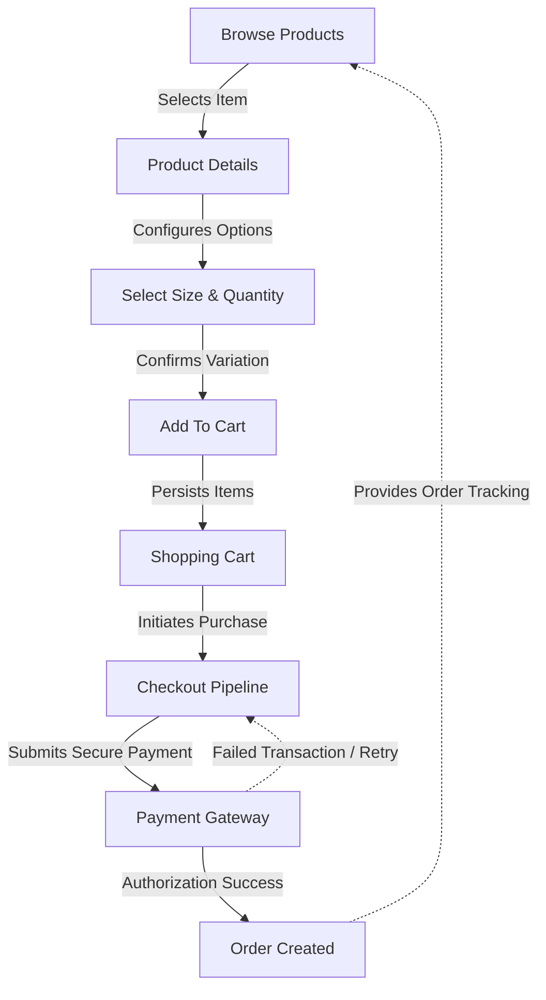

This flow minimizes unnecessary steps while providing a familiar purchasing experience.

---

# Order Workflow

Orders progress through several business states.

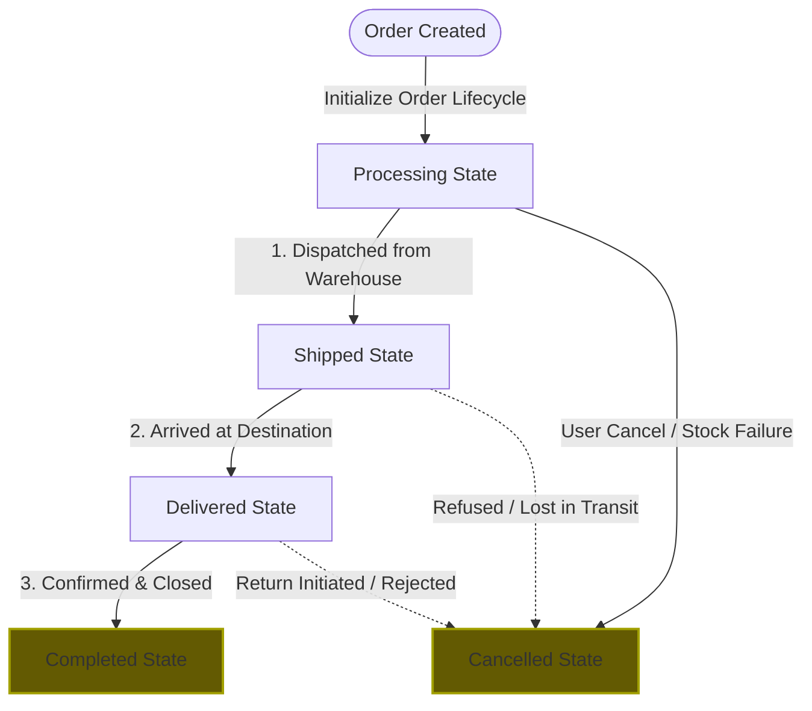

Each status represents a real business milestone during order fulfillment.

---

# Payment Workflow

Grace currently supports two payment methods.

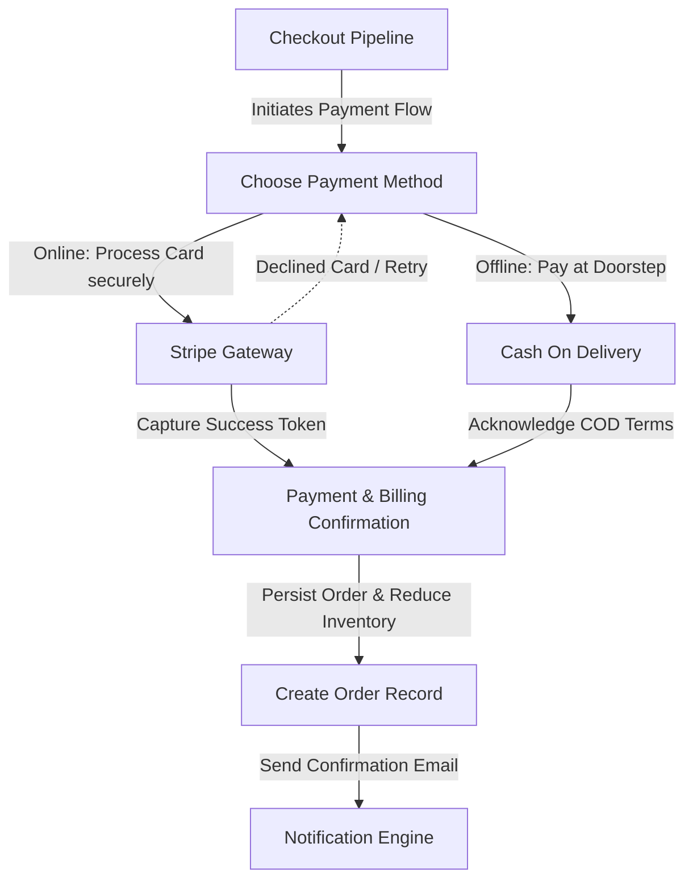

Stripe securely processes online transactions, while Cash on Delivery supports customers who prefer offline payment.

---

# Review Workflow

Product reviews help improve customer confidence.

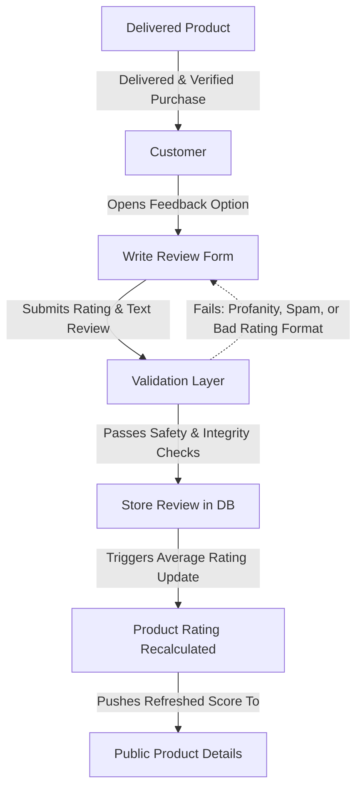

Only validated review data is persisted.

---

# Notification Workflow

Notifications keep customers informed throughout their shopping journey.

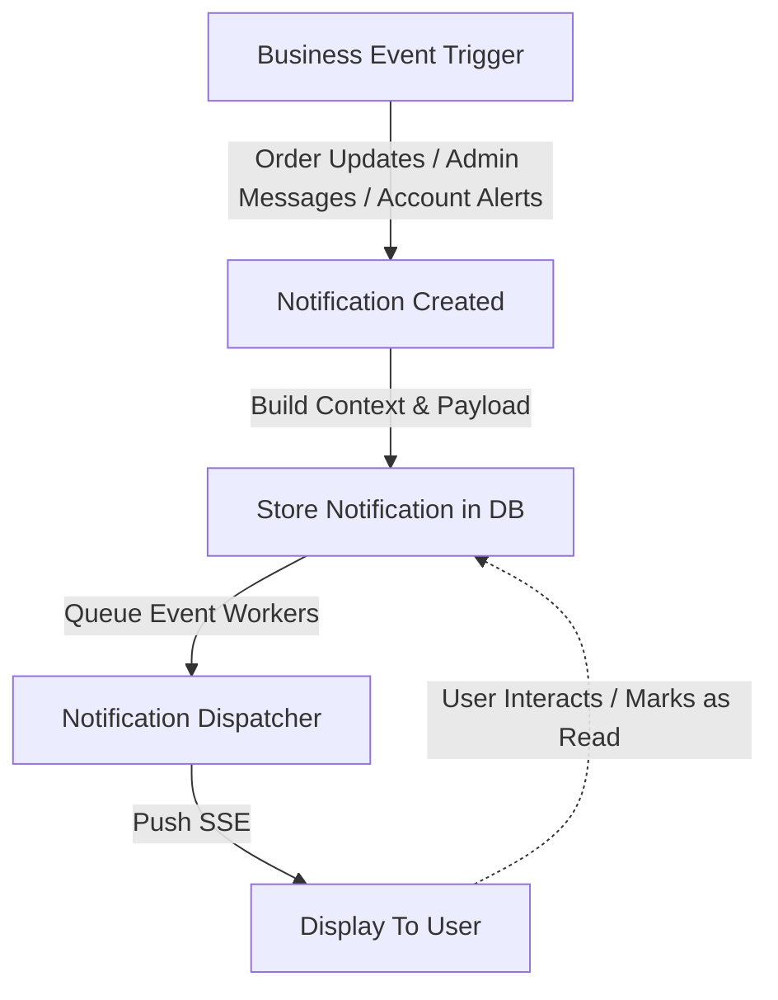

Typical events include:

- Order updates
- Administrative messages
- Account notifications

---

# Cache Workflow

Grace reduces unnecessary database operations through caching.

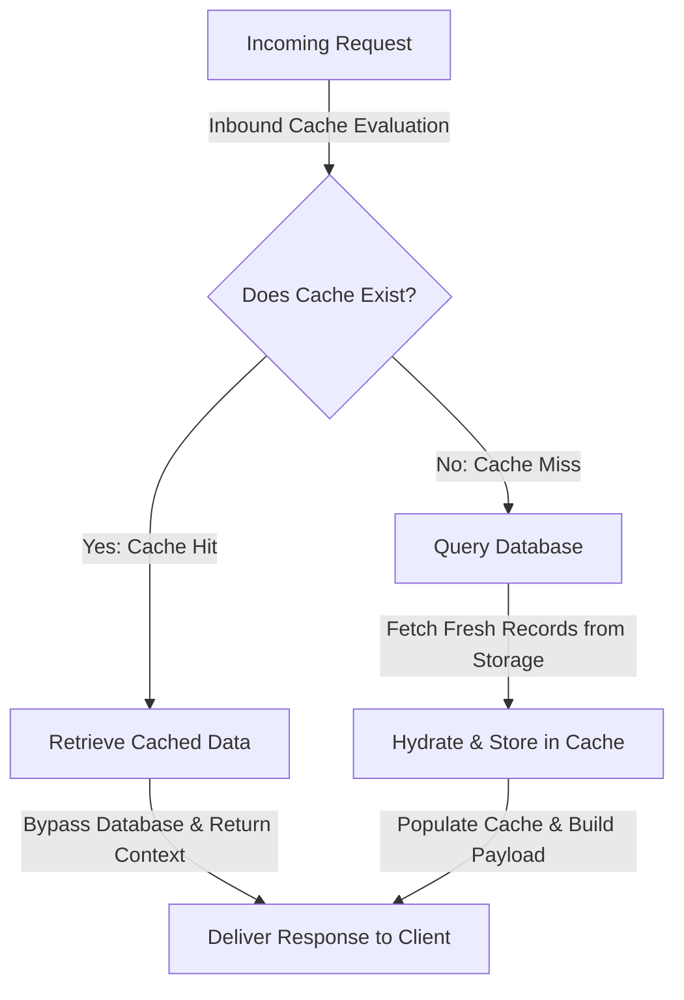

This approach significantly improves application responsiveness.

---

# Error Handling Workflow

Unexpected errors are handled gracefully.

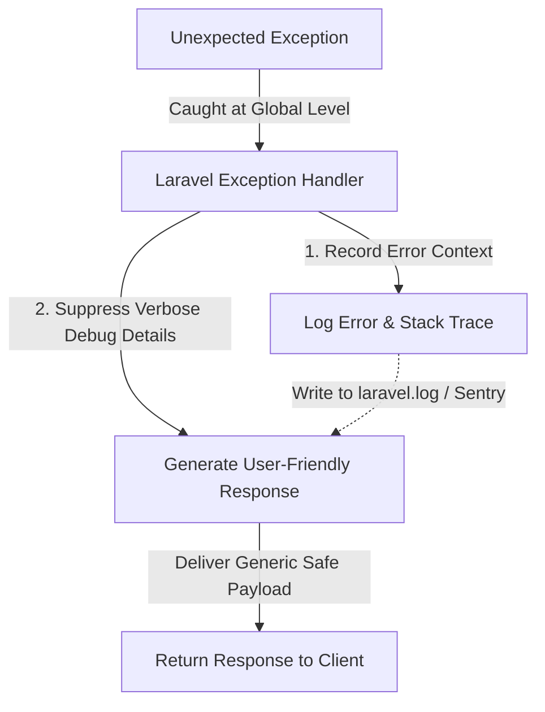

Internal implementation details remain hidden from end users.

---

# Overall System Workflow

The following diagram summarizes the interaction between the major application modules.

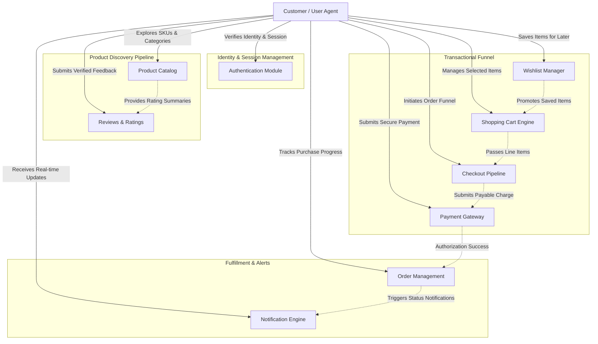

Although each module operates independently, together they form a complete e-commerce workflow.

---

# Summary

Grace is organized around a modular request lifecycle where every component has a clearly defined responsibility.

By combining Laravel's MVC architecture with middleware, validation, reusable helpers, caching, Eloquent models, and Blade templates, the application maintains a clean execution flow that is easy to understand, extend, and maintain.

The documented workflows demonstrate not only how individual features operate but also how the different modules collaborate to deliver a complete online shopping experience.

---

# Continue Reading

➡ **12-routing-and-application-flow.md**
