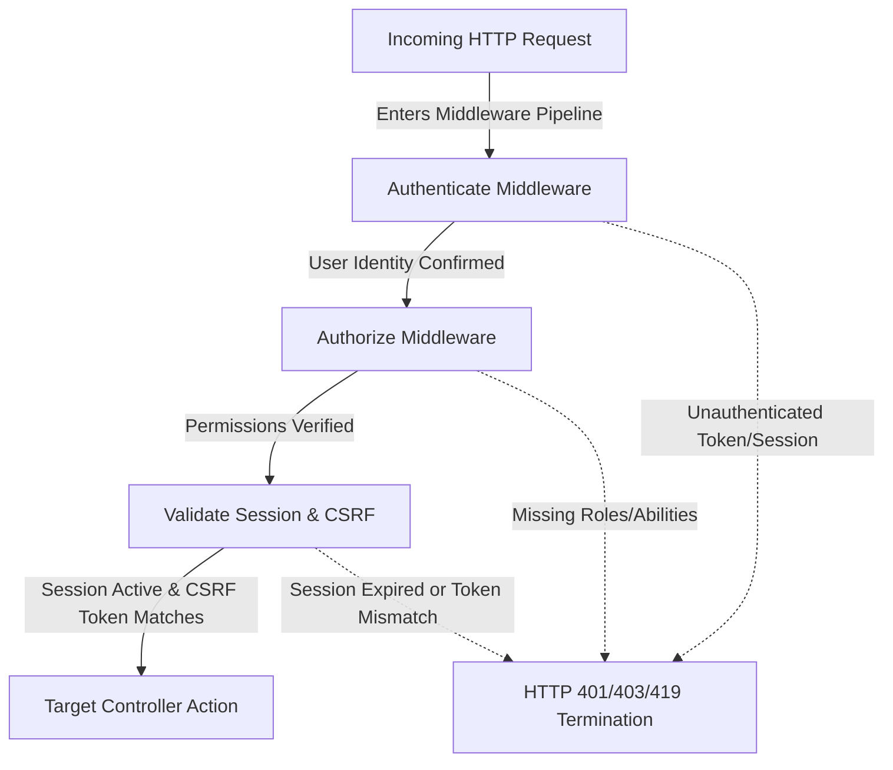

# Routing & Application Flow

---

# Table of Contents

- [Introduction](#introduction)
- [Routing Philosophy](#routing-philosophy)
- [Route Organization](#route-organization)
- [Request Lifecycle](#request-lifecycle)
- [Route Groups](#route-groups)
- [Middleware Pipeline](#middleware-pipeline)
- [Route Naming Convention](#route-naming-convention)
- [Controller Responsibilities](#controller-responsibilities)
- [Validation Flow](#validation-flow)
- [Response Types](#response-types)
- [AJAX Endpoints](#ajax-endpoints)
- [Route Security](#route-security)
- [Route Caching](#route-caching)
- [Best Practices](#best-practices)
- [Summary](#summary)

---

# Introduction

Routing is the entry point of every request handled by the application.

Grace adopts a modular routing strategy that organizes endpoints according to business domains rather than placing every route inside a single file.

This approach improves readability, simplifies maintenance, and allows developers to locate functionality quickly as the project grows.

---

# Routing Philosophy

Every route should have one clear responsibility.

Routes should never contain business logic.

Instead, they should only:

- Receive an HTTP request.
- Apply middleware.
- Forward the request to the appropriate controller.
- Return the generated response.

This keeps routing predictable and easy to maintain.

---

# Route Organization

Rather than accumulating hundreds of routes inside one file, Grace organizes routes according to application modules.

Examples include:

```text
routes/
│
├── 📂 admin/
│   ├── admin-routes.php
│   ├── main-views.php
│   └── search.php
├── 📂 auth/
│   └── auth-routes.php
├── 📂 guest/
│   └── guest-routes.php
├── api.php
└── web.php
```

Each route file focuses on a single business domain, reducing complexity and making navigation significantly easier.

---

# Request Lifecycle

Every request follows a consistent execution path.


This layered flow ensures that responsibilities remain separated throughout the request lifecycle.

---

# Route Groups

Related routes are grouped together.

Typical grouping criteria include:

- Authentication
- Administration
- Products
- Orders
- Reviews
- Customer Account
- Notifications

Grouping reduces duplication while allowing middleware to be applied collectively.

Example:

```php
Route::middleware(['auth'])
     ->group(function () {

        // Protected Routes

});
```

---

# Middleware Pipeline

Before a request reaches its controller, it passes through one or more middleware.

Typical middleware responsibilities include:

- Authentication
- Authorization
- Session Management
- Guest Restrictions
- CSRF Verification
- Request Filtering

Each middleware performs a specific task before passing the request to the next stage.



---

# Route Naming Convention

Grace uses named routes consistently across the application.

Benefits include:

- Easier URL generation.
- Cleaner redirects.
- Reduced hardcoded paths.
- Better maintainability.
- Simplified refactoring.

Blade templates and controllers reference route names instead of literal URLs.

---

# Controller Responsibilities

Controllers act as coordinators rather than containers for complex business logic.

Typical controller responsibilities include:

- Receiving requests.
- Invoking validation.
- Calling reusable helpers.
- Communicating with models.
- Returning responses.

Controllers intentionally remain lightweight to improve readability and testability.

---

# Validation Flow

User input is validated before any business operation is executed.

Validation ensures:

- Required fields exist.
- Data types are correct.
- Business rules are satisfied.
- Invalid requests are rejected early.

This protects the application while improving data integrity.

---

# Response Types

Depending on the request, controllers return different response types.

Examples include:

## Blade Views

Used for traditional page rendering.

Examples:

- Home Page
- Product Details
- Shopping Cart
- Checkout
- Dashboard

---

## Redirect Responses

Used after successful operations such as:

- Login
- Registration
- Checkout
- Profile Updates

---

## JSON Responses

Used primarily for asynchronous interactions.

Examples include:

- Wishlist operations
- Shopping cart updates
- Dynamic filtering
- Live search
- Notifications

---

# AJAX Endpoints

Grace enhances the user experience through AJAX-powered interactions.

Typical asynchronous operations include:

- Add to Wishlist
- Remove from Wishlist
- Add to Cart
- Update Cart Quantity
- Delete Cart Item
- Product Filtering
- Search
- Notification Updates

AJAX minimizes full page reloads and improves perceived performance.

---

# Route Security

Routes are protected according to their intended audience.

## Public Routes

Accessible without authentication.

Examples include:

- Home
- Products
- Categories
- Login
- Registration

---

## Authenticated Routes

Require a valid user session.

Examples include:

- Wishlist
- Checkout
- Orders
- Profile
- Reviews

---

## Administrative Routes

Restricted to authorized administrators.

Examples include:

- Product Management
- Category Management
- User Management
- Dashboard
- Notifications

This layered protection prevents unauthorized access to sensitive functionality.

---

# Route Caching

Laravel supports route caching in production.

```bash
php artisan route:cache
```

Benefits include:

- Faster application startup.
- Reduced route registration overhead.
- Improved request processing.

Route caching is recommended for production deployments after route definitions become stable.

---

# Best Practices

Grace follows several routing best practices.

- Named Routes
- Modular Route Files
- Lightweight Controllers
- Middleware-Based Security
- Centralized Validation
- REST-inspired URL structure
- Consistent naming conventions
- Separation of routing and business logic

These practices contribute to a clean and maintainable routing layer.

---

# Summary

The routing architecture of Grace emphasizes organization, consistency, and separation of concerns.

By combining modular route files, middleware, named routes, lightweight controllers, and AJAX-powered interactions, the application maintains a predictable request flow that is easy to understand, secure, and scalable.

The routing layer serves as a solid foundation for the entire application while remaining flexible enough to support future growth.

---

# Continue Reading

➡ **13-future-enhancements.md**
