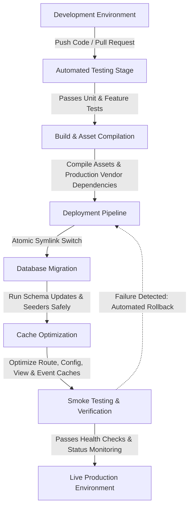

# Production Deployment

---

# Table of Contents

- [Introduction](#introduction)
- [Deployment Strategy](#deployment-strategy)
- [Server Requirements](#server-requirements)
- [Preparing the Production Environment](#preparing-the-production-environment)
- [Uploading the Project](#uploading-the-project)
- [Installing Dependencies](#installing-dependencies)
- [Environment Configuration](#environment-configuration)
- [File Permissions](#file-permissions)
- [Storage Configuration](#storage-configuration)
- [Database Migration](#database-migration)
- [Database Seeding (Optional)](#database-seeding-optional)
- [Laravel Application Optimization](#laravel-application-optimization)
- [HTTPS Configuration](#https-configuration)
- [Logging](#logging)
- [Backup Strategy](#backup-strategy)
- [Monitoring](#monitoring)
- [Post-Deployment Checklist](#post-deployment-checklist)
- [Troubleshooting](#troubleshooting)
- [Permission Errors](#permission-errors)
- [Production Best Practices](#production-best-practices)
- [Deployment Summary](#deployment-summary)

---

# Introduction

Deploying an application to production requires more than simply copying files to a server.

A production environment must provide security, reliability, scalability, and maintainability while minimizing downtime.

This guide describes the recommended deployment process for Grace and highlights the configuration steps necessary to prepare the application for real-world usage.

---

# Deployment Strategy

Grace follows Laravel's standard deployment workflow while incorporating additional optimization steps.

A typical deployment consists of the following stages:



Each stage should be completed successfully before moving to the next.

---

# Server Requirements

Recommended production environment:

| Component       | Recommended Version |
|-----------------|---------------------|
| PHP             | 8.2+                |
| MySQL           | 8.x                 |
| Composer        | Latest              |
| Node.js         | 18+                 |
| Nginx / Apache  | Latest Stable       |
| Redis           | Recommended         |
| SSL Certificate | Required            |

---

# Preparing the Production Environment

Before deploying, verify that:

- PHP extensions are installed.
- Database server is running.
- Web server is configured.
- SSL certificates are available.
- Environment variables are prepared.
- File permissions are correct.

---

# Uploading the Project

Clone the repository directly on the server.

```bash
git clone https://github.com/your-username/grace.git
```

or upload the project using your preferred deployment workflow.

---

# Installing Dependencies

Install Composer dependencies.

```bash
composer install --optimize-autoloader --no-dev
```

Install frontend dependencies.

```bash
npm install
```

Compile production assets.

```bash
npm run production
```

---

# Environment Configuration

Create the production environment file.

```bash
cp .env.example .env
```

Update production values.

Examples include:

- Database
- Mail
- Stripe
- OAuth Providers
- Redis
- Session Driver
- Queue Driver
- Cache Driver

Never commit production credentials into Git.

---

# File Permissions

Laravel requires write access to:

```
storage/

bootstrap/cache/
```

Example:

```bash
chmod -R 775 storage

chmod -R 775 bootstrap/cache
```

---

# Storage Configuration

Create the storage symlink.

```bash
php artisan storage:link
```

Uploaded images will now be publicly accessible.

---

# Database Migration

Run all migrations.

```bash
php artisan migrate --force
```

The `--force` flag allows migrations to execute in production.

---

# Database Seeding (Optional)

If production seeders are required:

```bash
php artisan db:seed --force
```

Use with caution.

---

# Laravel Application Optimization

Before serving production traffic, optimize the application.

```bash
php artisan optimize

php artisan config:cache

php artisan route:cache

php artisan view:cache
```

These commands reduce application boot time and improve request performance.

---

# HTTPS Configuration

Always serve the application over HTTPS.

Benefits include:

- Encrypted communication
- Secure authentication
- Protected payment sessions
- Improved browser trust
- Better SEO

A valid SSL certificate is strongly recommended for every deployment.

---

# Logging

Laravel automatically records runtime events inside:

```
storage/logs/
```

Production logging should be monitored regularly to detect:

- Unexpected exceptions
- Failed jobs
- Database errors
- Authentication failures

---

# Backup Strategy

Regular backups are essential.

Recommended backup targets:

- Database
- Uploaded Files
- Environment Configuration
- Storage Directory

Backups should be automated and stored securely.

---

# Monitoring

A production application should be continuously monitored.

Examples include:

- Server availability
- CPU usage
- Memory consumption
- Disk usage
- Database performance
- Queue health
- Error rates

Monitoring helps identify issues before they impact users.

---

# Post-Deployment Checklist

Before going live, verify the following:

| Item                   | Status |
|------------------------|--------|
| Dependencies Installed | ✅      |
| Environment Configured | ✅      |
| Database Migrated      | ✅      |
| Storage Linked         | ✅      |
| Assets Built           | ✅      |
| HTTPS Enabled          | ✅      |
| Queue Running          | ✅      |
| Scheduler Configured   | ✅      |
| Cache Optimized        | ✅      |
| Logs Verified          | ✅      |

---

# Troubleshooting

## Blank Page

Run:

```bash
php artisan optimize:clear
```

---

## Permission Errors

Verify permissions for:

- storage/
- bootstrap/cache/

---

## Images Missing

Run:

```bash
php artisan storage:link
```

---

## Cache Problems

Clear all caches.

```bash
php artisan optimize:clear
```

---

## Environment Changes Not Applied

Rebuild configuration cache.

```bash
php artisan config:cache
```

---

# Production Best Practices

For production deployments, it is recommended to:

- Disable debug mode.
- Use Redis for caching and sessions.
- Enforce HTTPS.
- Keep dependencies up to date.
- Monitor application logs.
- Enable automated backups.
- Rotate secrets periodically.
- Review server security updates.
- Test deployments in a staging environment before production.

---

# Deployment Summary

Grace is designed to be deployed using Laravel's standard production workflow while benefiting from additional optimizations such as configuration caching, route caching, asset compilation, queue processing, and environment-based configuration.

Following this deployment guide helps ensure that the application remains secure, performant, and maintainable in production.

---

# Continue Reading

➡ **[Development Methodology](./development-methodology)**
