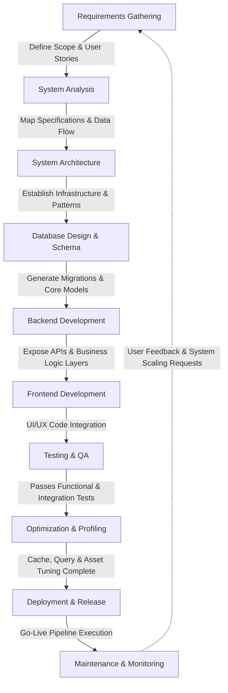

# Development Methodology

---

# Table of Contents

- [Introduction](#introduction)
- [Engineering Philosophy](#engineering-philosophy)
- [Software Development Approach](#software-development-approach)
- [Architectural Principles](#architectural-principles)
- [Design Patterns](#design-patterns)
- [Project Organization Strategy](#project-organization-strategy)
- [Coding Standards](#coding-standards)
- [Separation of Business Logic](#separation-of-business-logic)
- [Reusability](#reusability)
- [Maintainability](#maintainability)
- [Scalability](#scalability)
- [Configuration Strategy](#configuration-strategy)
- [Error Handling Strategy](#error-handling-strategy)
- [Security by Design](#security-by-design)
- [Performance-Oriented Development](#performance-oriented-development)
- [Development Workflow](#development-workflow)
- [Engineering Decisions](#engineering-decisions)
- [Conclusion](#conclusion)

---

# Introduction

Grace was developed with a strong emphasis on software engineering rather than simply implementing business functionality.

Throughout the development process, architectural quality was considered just as important as feature completeness.

The project follows modern Laravel development practices while introducing additional engineering layers that improve maintainability, consistency, extensibility, and long-term scalability.

Rather than treating the application as a collection of independent CRUD operations, the project has been designed as a cohesive software system where each component has a clearly defined responsibility.

---

# Engineering Philosophy

The central philosophy behind Grace can be summarized in one sentence:

> **Build once, reuse everywhere.**

Every engineering decision was guided by this principle.

Whenever a piece of logic appeared repeatedly, it was extracted into a reusable abstraction instead of being duplicated.

This philosophy resulted in a cleaner architecture, lower maintenance cost, and a significantly more scalable codebase.

---

# Software Development Approach

The application follows an incremental and modular development strategy.

Instead of building isolated pages independently, functionality was organized into business modules.

Each module evolved independently while sharing common infrastructure provided by the framework and custom project components.

Examples include:

- Authentication Module
- User Module
- Product Module
- Category Module
- Subcategory Module
- Order Module
- Review Module
- Notification Module

This modular approach simplifies testing, debugging, maintenance, and future development.

---

# Architectural Principles

Several engineering principles guided the implementation.

## Separation of Concerns

Each layer has one primary responsibility.

- Routes define endpoints.
- Middleware handles request filtering.
- Controllers coordinate requests.
- Validation verifies user input.
- Models manage data.
- Views present information.

This separation keeps the codebase organized and easier to maintain.

---

## DRY (Don't Repeat Yourself)

Repeated logic increases maintenance effort and introduces inconsistencies.

Grace minimizes duplication by centralizing shared functionality into:

- Helper Functions
- Traits
- Blade Components
- Blade Partials
- Standards
- Configuration Files

Updating one shared implementation automatically benefits every module that depends on it.

---

## Convention Over Configuration

Whenever Laravel already provides a reliable convention, the project follows it.

Custom solutions are introduced only when they provide clear architectural value.

This balance keeps the application familiar to Laravel developers while still supporting project-specific requirements.

---

## Single Responsibility

Each class focuses on one primary purpose.

- Controllers coordinate requests.
- Models represent data.
- Helpers encapsulate reusable utilities.
- Traits provide shared behavior.
- Providers register framework extensions.

Keeping responsibilities focused reduces coupling and improves readability.

---

# Design Patterns

Although the project does not explicitly implement every classical design pattern, several recurring patterns naturally emerge from the architecture.

Examples include:

- MVC
- Dependency Injection
- Factory Pattern
- Repository-like Query Organization
- Strategy through Configuration
- Service Registration
- Component-Based UI

Laravel's service container also encourages inversion of control and loose coupling.

---

# Project Organization Strategy

One of the project's strengths is its structured organization.

Instead of placing every utility inside controllers, Grace introduces dedicated architectural layers.

Examples include:

- Standards
- Helpers
- Contracts
- Services
- Traits
- Providers
- Notifications
- Components

Each layer has a well-defined responsibility.

This organization reduces complexity while improving discoverability.

---

# Coding Standards

The project follows consistent coding conventions throughout the codebase.

Examples include:

- Meaningful naming
- Consistent file organization
- Predictable folder structure
- Standardized constants
- Reusable helper methods
- Consistent validation
- Uniform CRUD implementation

Consistency improves readability and lowers the learning curve for new contributors.

---

# Separation of Business Logic

Business logic is intentionally separated from presentation logic.

- Blade templates remain focused on rendering user interfaces.
- Controllers coordinate application flow.
- Reusable utilities handle common operations.
- Database models represent persistent business entities.

This separation improves maintainability while reducing accidental coupling.

---

# Reusability

A significant portion of the application has been built around reusable infrastructure.

Examples include:

- CRUD utilities
- Cache utilities
- File utilities
- Image utilities
- Shared Blade Components
- Validation helpers
- Constants
- Route naming conventions

Rather than solving the same problem repeatedly, reusable components provide standardized solutions.

---

# Maintainability

Maintainability has been prioritized throughout the project.

Several architectural decisions contribute directly to this goal.

Examples include:

- Modular folders
- Centralized constants
- Shared helper functions
- Configuration-driven behavior
- Organized routing
- Consistent naming

These practices reduce maintenance effort while improving long-term code quality.

---

# Scalability

Grace has been designed with future growth in mind.

The architecture allows additional functionality to be introduced without major restructuring.

Examples include:

- Additional payment gateways
- New authentication providers
- REST APIs
- Mobile applications
- Multi-vendor support
- Recommendation systems
- Loyalty programs

Because modules remain loosely coupled, future expansion can occur incrementally.

---

# Configuration Strategy

Configuration values are centralized rather than hardcoded.

Examples include:

- Database
- Mail
- Authentication
- Cache
- Sessions
- Payment Services
- OAuth Providers

This approach simplifies deployment across multiple environments while reducing configuration errors.

---

# Error Handling Strategy

Grace relies on Laravel's exception handling mechanisms while maintaining a clean user experience.

Unexpected exceptions are logged for developers while user-facing error messages remain concise and informative.

This separation improves debugging without exposing internal implementation details.

---

# Security by Design

Security was considered throughout development rather than being added afterward.

Examples include:

- Middleware protection
- Authentication
- Authorization
- Request validation
- CSRF protection
- ORM-based database access
- Secure password hashing

Security responsibilities remain distributed across multiple application layers.

---

# Performance-Oriented Development

Performance considerations influenced architectural decisions from the beginning.

Examples include:

- Cache support
- Redis compatibility
- AJAX interactions
- Optimized Eloquent queries
- Fast pagination
- Reusable infrastructure
- Optimized assets

These optimizations improve responsiveness while supporting future scalability.

---

# Development Workflow

The overall development process follows a structured workflow.

Each phase builds upon the previous one while maintaining clear engineering boundaries.

---

# Engineering Decisions

Several architectural decisions distinguish Grace from a conventional Laravel application.

These include:

- Introducing a centralized Standards layer to eliminate scattered literal values.
- Creating reusable helper utilities to reduce duplicated business logic.
- Organizing routes by business domain instead of accumulating them in a single file.
- Extending Laravel through service providers and custom Blade directives.
- Structuring the application around reusable infrastructure rather than isolated CRUD controllers.
- Designing modules with future extensibility in mind.

These choices improve consistency, maintainability, and long-term scalability.

---

# Conclusion

Grace is more than a functional e-commerce application.

It is an example of applying software engineering principles to Laravel development.

By emphasizing modularity, reusability, maintainability, security, and scalability, the project demonstrates how thoughtful architectural decisions can produce a codebase that remains clean, extensible, and suitable for real-world growth.

---

# Continue Reading

➡ **[Project Workflow](./project-workflow)**
