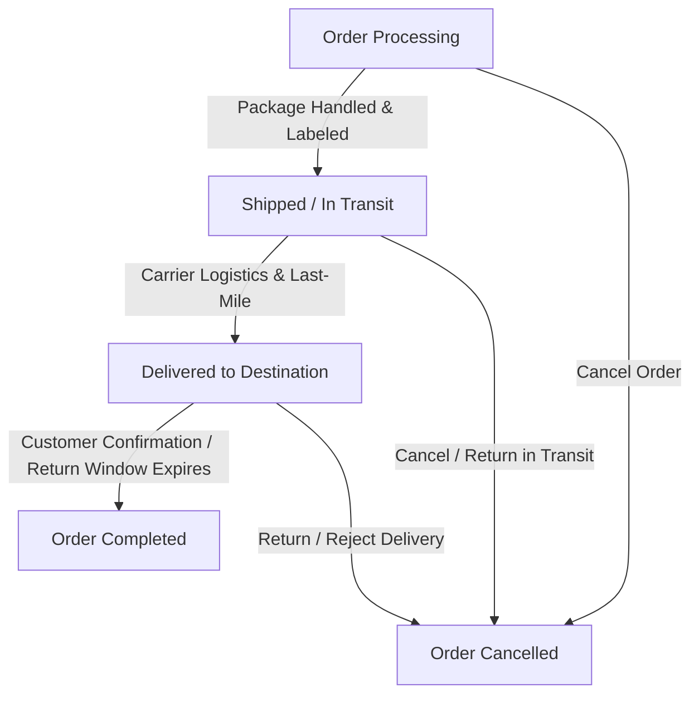

# Features

---

# Table of Contents

- [Introduction](#introduction)
- [Authentication & Authorization](#authentication--authorization)
- [Customer Management](#customer-management)
- [Product Catalog](#product-catalog)
- [Shopping Experience](#shopping-experience)
- [Wishlist](#wishlist)
- [Shopping Cart](#shopping-cart)
- [Checkout](#checkout)
- [Payment Processing](#payment-processing)
- [Order Management](#order-management)
- [Product Reviews](#product-reviews)
- [Notifications](#notifications)
- [Search & Filtering](#search--filtering)
- [Administration Dashboard](#administration-dashboard)
- [Content Management](#content-management)
- [Localization](#localization)
- [Developer Features](#developer-features)
- [Security Features](#security-features)
- [Performance Features](#performance-features)

---

# Introduction

Grace is a complete fashion e-commerce platform designed to support every stage of the customer's shopping journey while providing administrators with full control over business operations.

Its functionality is divided into logical modules, each responsible for a specific business domain. This modular organization simplifies future maintenance, improves scalability, and keeps the application easy to understand.

---

# Authentication & Authorization

The authentication system provides secure access for both customers and administrators.

## Features

- User Registration
- Secure Login
- Logout
- Remember Me
- Password Reset
- Email Verification (if enabled)
- Profile Management
- Password Update
- Social Authentication
    - Google
    - Facebook
    - GitHub
- Session Management

## Benefits

- Secure user identity management.
- Simplified registration process.
- Reduced friction through social login.
- Protected access to authenticated resources.

---

# Customer Management

Customers can maintain their personal information directly from their account.

## Features

- Update personal information
- Manage delivery addresses
- View order history
- Track current orders
- Manage wishlist
- Update password
- Receive notifications

---

# Product Catalog

The catalog is organized to provide a clean and intuitive browsing experience.

## Features

- Main Categories
- Subcategories
- Product Collections
- Product Variants
- Multiple Images
- Multiple Sizes
- Product Availability
- Product Ratings
- Product Reviews

Each product page presents comprehensive information, enabling customers to make informed purchasing decisions.

---

# Shopping Experience

Grace focuses on creating a smooth shopping journey from product discovery to checkout.

## Features

- Responsive Interface
- Product Cards
- Product Details
- Image Galleries
- Related Products
- Recently Viewed Products (future enhancement)
- Mobile Friendly Layout

---

# Wishlist

Customers can save products for future purchases.

## Features

- Add to Wishlist
- Remove from Wishlist
- View Saved Products
- Persistent Wishlist

Benefits include:

- Easier product comparison.
- Improved shopping convenience.
- Increased customer engagement.

---

# Shopping Cart

The shopping cart allows customers to manage intended purchases before checkout.

## Features

- Add Products
- Remove Products
- Update Quantities
- View Cart Summary
- Calculate Total Price
- Dynamic Cart Updates

The cart remains synchronized with the user's account, ensuring a consistent shopping experience.

---

# Checkout

The checkout workflow has been designed to minimize unnecessary steps while maintaining transaction security.

## Features

- Shipping Address Selection
- Order Summary
- Payment Selection
- Order Confirmation

Supported payment methods include:

- Stripe
- Cash on Delivery

---

# Payment Processing

Grace supports multiple payment options to accommodate different customer preferences.

## Stripe

Customers can securely complete online payments using Stripe's payment gateway.

Benefits include:

- Secure transactions
- PCI-compliant payment processing
- Reliable payment infrastructure

## Cash on Delivery

Customers may alternatively place orders without immediate online payment.

---

# Order Management

The order module manages the complete lifecycle of every purchase.

## Order Status Workflow

Orders may also be cancelled before completion when applicable.

## Features

- Order Creation
- Order Tracking
- Status Updates
- Order History
- Customer Notifications

---

# Product Reviews

Customers can share their shopping experience through product reviews.

## Features

- Create Reviews
- Update Reviews
- Delete Reviews
- Product Ratings

Reviews increase customer confidence while providing valuable product feedback.

---

# Notifications

The notification system keeps users informed throughout their shopping journey.

Examples include:

- Account Notifications
- Order Updates
- Administrative Messages
- Review Notifications

---

# Search & Filtering

Grace provides powerful tools for locating products quickly.

## Search

Customers can search using keywords to locate products efficiently.

## Filtering

Products can be filtered using multiple criteria, including:

- Category
- Subcategory
- Collection
- Price
- Size
- Color (if available)

These capabilities significantly improve product discoverability.

---

# Administration Dashboard

The administration panel centralizes all business operations into one interface.

## Dashboard Modules

- Categories
- Subcategories
- Products
- Product Images
- Product Sizes
- Customers
- Orders
- Reviews
- Notifications

Administrators can efficiently perform all CRUD operations through a unified interface.

---

# Content Management

Grace simplifies content organization through structured management tools.

Examples include:

- Category Organization
- Product Organization
- Collection Management
- Media Management

---

# Localization

The project supports language files that centralize application messages and improve maintainability.

Benefits include:

- Easier translation
- Consistent messaging
- Simplified localization

---

# Developer Features

Several features have been implemented specifically to improve developer productivity.

These include:

- Reusable Helper Functions
- Standardized Constants
- Modular Route Organization
- Custom Blade Directives
- Blade Components
- Service Providers
- Traits
- Shared CRUD Infrastructure
- Image Management Utilities
- Centralized Configuration

These engineering decisions reduce repetitive code while improving maintainability.

---

# Security Features

Security is integrated throughout the application.

Examples include:

- Authentication
- Authorization
- Route Protection
- Request Validation
- CSRF Protection
- Password Hashing
- Middleware-Based Security
- Secure Payment Integration

---

# Performance Features

Grace includes several optimizations to improve responsiveness.

Examples include:

- Fast Pagination
- Cache Support
- Redis Compatibility
- AJAX Requests
- Optimized Queries
- Image Optimization
- Asset Minification
- Modular Components

These optimizations collectively contribute to a fast and responsive user experience.

---

# Continue Reading

➡ **[Folder Structure](./folder-structure)**
