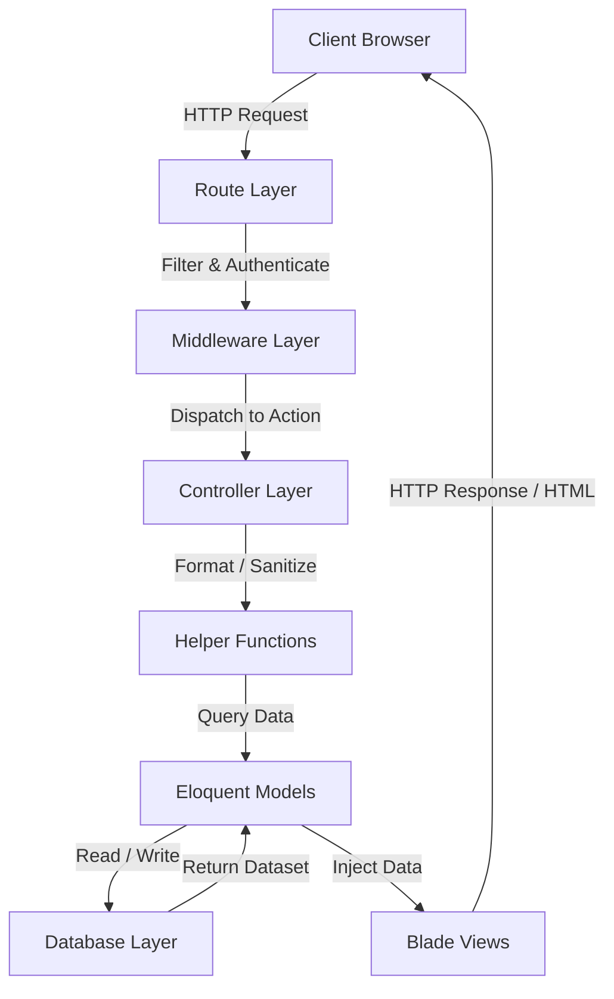

# Project Structure

---

# Table of Contents

- [Overview](#overview)
- [Root Directory](#root-directory)
- [Application Layer (app/)](#application-layer-app)
- [Bootstrap (bootstrap/)](#bootstrap-bootstrap)
- [Configuration Layer (config/)](#configuration-layer-config)
- [Database Layer (database/)](#database-layer-database)
- [Language Files (lang/)](#language-files-lang)
- [Public Directory (public/)](#public-directory-public)
- [Resources Layer (resources/)](#resources-layer-resources)
- [Routes (routes/)](#routes-routes)
- [Storage (storage/)](#storage-storage)
- [Vendor Packages (vendor/)](#vendor-packages-vendor)
- [Composer Configuration](#composer-configuration)
- [NPM Configuration](#npm-configuration)
- [Folder Relationships](#folder-relationships)
- [Architectural Advantages](#architectural-advantages)

---

# Overview

Grace follows a modular project structure built on top of Laravel 9.

Rather than relying solely on Laravel's default organization, the project extends the framework with additional abstraction layers that improve maintainability, readability, scalability, and code reuse.

Every directory has a clearly defined responsibility.

This organization enables developers to quickly locate source files while reducing coupling between different application components.

---

# Root Directory

```
Grace
│
├── 📂 app/
├── 📂 bootstrap/
├── 📂 config/
├── 📂 database/
├── 📂 lang/
├── 📂 public/
├── 📂 resources/
├── 📂 routes/
├── 📂 storage/
├── 📂 tests/
├── 📂 vendor/
│
├── artisan
├── composer.json
├── package.json
└── README.md
```

Each directory contributes to one specific layer of the application architecture.

---

# Application Layer (`app/`)

The `app` directory contains the application's core business logic.

```
📂 app/
│
├── 📂 Console/
│   └── 📂 Commands/
├── 📂 Contracts/
├── 📂 Exceptions/
├── 📂 Helpers/
├── 📂 Http/
│   ├── 📂 Controllers/
│   ├── 📂 Middleware/
│   └── 📂 Requests/
├── 📂 Mail/
├── 📂 Models/
├── 📂 Notifications/
├── 📂 Providers/
├── 📂 Services/
└── 📂 Traits/
```

This is the heart of the system.

It contains the application's custom architecture beyond Laravel's default implementation.

---

## Controllers

Controllers coordinate incoming requests.

Responsibilities include:

- Receiving requests
- Validating input
- Executing business operations
- Returning responses

Controllers remain intentionally lightweight by delegating reusable logic to helper utilities and shared infrastructure whenever possible.

---

## Models

Models represent the application's business entities.

Examples include:

- Users
- Products
- Categories
- Orders
- Reviews
- Wishlists
- Addresses
- Notifications

Relationships between these entities are implemented using Laravel's Eloquent ORM.

---

## Middleware

Middleware protects routes before requests reach controllers.

Examples include:

- Authentication
- Authorization
- Guest Restrictions
- Session Handling
- Request Filtering

This ensures security concerns remain separated from business logic.

---

## Requests

Form Request classes encapsulate validation rules.

Benefits include:

- Cleaner controllers
- Centralized validation
- Better maintainability
- Consistent error handling

---

## Helpers

One of Grace's distinguishing architectural features is its helper layer.

Instead of repeating common logic across controllers, reusable helper functions centralize frequently used operations.

Examples include:

- CRUD utilities
- Cache management
- Image handling
- Route generation
- Collection utilities
- File management
- Notification helpers

This significantly reduces duplicated code.

---

## Services

The Services layer provides centralized definitions for values reused throughout the application.

Examples include:

- Route names
- Table names
- View names
- Model identifiers
- Cache keys
- CRUD operation names
- Foreign keys
- Component names
- Validation constants

Centralizing these values eliminates scattered literal strings and improves consistency across the codebase.

---

## Traits

Traits provide reusable behaviors shared by multiple classes.

Rather than duplicating functionality, common behaviors are composed where needed.

This promotes modularity and keeps classes focused on their primary responsibilities.

---

## Notifications

Notification classes encapsulate user-facing system notifications.

These are responsible for communicating important application events such as order updates and account-related activities.

---

## Providers

Service providers extend Laravel's bootstrap process.

Responsibilities include:

- Registering custom services
- Loading helper files
- Registering Blade directives
- Registering macros
- Bootstrapping project infrastructure

---

## Console

Contains custom Artisan commands used during development and maintenance.

These commands automate repetitive tasks and improve developer productivity.

---

# Bootstrap (`bootstrap/`)

Responsible for initializing Laravel before requests are processed.

It loads:

- Configuration
- Service Providers
- Environment Variables
- Framework Components

This directory forms the foundation of the application's startup sequence.

---

# Configuration Layer (`config/`)

The configuration layer centralizes all configurable application behavior.

Examples include:

- Authentication
- Cache
- Sessions
- Mail
- Database
- Filesystems
- Stripe
- Social Login
- Logging

Using Laravel's configuration system allows deployment environments to be changed without modifying application code.

---

# Database Layer (`database/`)

The database layer defines the application's persistent data model.

```
database
└── migrations
```

## Migrations

Migrations define database schema evolution.

Benefits include:

- Version-controlled schema
- Repeatable deployments
- Easy rollback

---

# Language Files (`lang/`)

Language files centralize all application messages.

Advantages include:

- Easier localization
- Consistent messaging
- Cleaner source code
- Future multilingual support

---

# Public Directory (`public/`)

The public directory contains all publicly accessible assets.

Examples include:

- Assets
- CSS
- Icons
- JavaScript
- Sounds
- Storage
- Uploaded files (Images)

This directory also acts as Laravel's public web root.

---

# Resources Layer (`resources/`)

The resources directory contains the application's presentation layer.

```
resources
│
├── css
├── js
└── views
```

---

## CSS

Contains application-specific styling.

---

## JavaScript

Contains interactive client-side functionality, including AJAX operations and dynamic user interactions.

---

## Views

Blade templates define the application's user interface.

The project extensively uses:

- Layouts
- Components
- Partials
- Reusable UI elements

This organization minimizes duplication while maintaining visual consistency.

---

# Routes (`routes/`)

The routing layer maps HTTP requests to application functionality.

Routes are organized by responsibility rather than accumulating inside a single file.

Benefits include:

- Better readability
- Easier navigation
- Modular development

Middleware is applied where necessary to protect restricted functionality.

---

# Storage (`storage/`)

Stores runtime-generated application data.

Examples include:

- Logs
- Cache
- Sessions
- Temporary Files
- Compiled Views

The storage directory remains outside the public web root to improve security.

---

# Vendor Packages (`vendor/`)

Contains all Composer-managed dependencies.

These packages extend the framework with additional functionality while keeping application code clean.

Examples include:

- Laravel Framework
- Stripe SDK
- Socialite
- Guzzle
- Redis Client
- Other third-party libraries

---

# Composer Configuration

`composer.json` defines:

- PHP dependencies
- PSR-4 autoloading
- Development packages
- Laravel package discovery
- Composer scripts

Composer provides dependency management while supporting automatic package registration.

---

# NPM Configuration

`package.json` defines frontend dependencies.

Examples include:

- Bootstrap
- JavaScript packages
- Build scripts

These dependencies are compiled into optimized frontend assets during deployment.

---

# Folder Relationships



Every directory contributes to one stage of the application's request lifecycle.

---

# Architectural Advantages

This project organization provides several benefits:

- Excellent maintainability
- High scalability
- Strong separation of concerns
- Improved readability
- Excellent code reuse
- Modular development
- Easier onboarding for new developers
- Cleaner project navigation
- Lower maintenance cost

The overall structure reflects a long-term architectural vision rather than a collection of unrelated Laravel files.

---

# Continue Reading

➡ **[Database Design](./database-design)**
