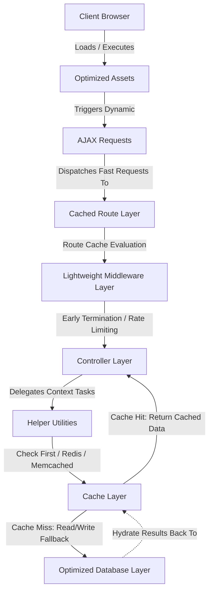

# Performance Optimization

---

# Table of Contents

- [Overview](#overview)
- [Performance Philosophy](#performance-philosophy)
- [Performance Architecture](#performance-architecture)
- [Efficient Database Access](#efficient-database-access)
- [Caching Strategy](#caching-strategy)
- [Cache Invalidation](#cache-invalidation)
- [Redis Support](#redis-support)
- [Fast Pagination](#fast-pagination)
- [Asset Optimization](#asset-optimization)
- [AJAX-Based Interactions](#ajax-based-interactions)
- [Image Optimization](#image-optimization)
- [Modular Architecture](#modular-architecture)
- [Reusable Components](#reusable-components)
- [Optimized Routing](#optimized-routing)
- [Laravel Optimizations](#laravel-optimizations)
- [Scalability Considerations](#scalability-considerations)
- [Performance Checklist](#performance-checklist)
- [Performance Summary](#performance-summary)

---

# Overview

Grace has been designed with performance as a first-class engineering concern.

Rather than relying on hardware upgrades to improve responsiveness, the application adopts a series of architectural and implementation strategies that reduce unnecessary computation, minimize database load, optimize network communication, and improve the overall user experience.

The goal is to deliver a responsive shopping experience even as the application grows in terms of users, products, and business operations.

---

# Performance Philosophy

The project follows several performance-oriented principles.

- Minimize database queries.
- Avoid duplicated computations.
- Cache expensive operations.
- Reduce unnecessary HTTP requests.
- Reuse application components.
- Load only what is needed.
- Keep controllers lightweight.
- Optimize frontend assets.
- Design for scalability from the beginning.

Performance is considered throughout the application lifecycle rather than being addressed only after development.

---

# Performance Architecture

The application optimizes performance at multiple layers.



Each layer contributes to reducing latency and unnecessary resource consumption.

---

# Efficient Database Access

Database operations are optimized through Laravel's Eloquent ORM while following best practices to reduce query overhead.

Examples include:

- Optimized relationships
- Efficient query construction
- Pagination
- Query reuse
- Reduced duplicate queries

These practices improve response times while lowering database workload.

---

# Caching Strategy

Grace makes extensive use of Laravel's caching system to reduce repetitive computations.

The cache layer stores frequently accessed data, allowing subsequent requests to retrieve information without repeatedly querying the database.

Examples of cached data include:

- Frequently viewed products
- Shared application data
- Configuration values
- Business utilities
- Reusable lookup data

Caching significantly improves response time while reducing database traffic.

---

# Cache Invalidation

Caching is only effective when stale data is handled correctly.

Grace follows a controlled cache invalidation strategy.

Whenever application data changes, related cache entries are refreshed or removed to ensure users always receive up-to-date information.

This approach balances performance with data consistency.

---

# Redis Support

The project supports Redis as a high-performance cache backend.

Redis provides:

- In-memory data storage
- Extremely fast read operations
- Reduced database load
- Improved scalability

Redis can be configured through Laravel's cache driver without changing application code.

---

# Fast Pagination

Displaying thousands of products simultaneously would negatively affect both the server and the browser.

Instead, Grace retrieves only the records required for the current page.

Benefits include:

- Faster database queries
- Lower memory usage
- Improved page loading
- Better user experience

Pagination also reduces unnecessary network traffic.

---

# Asset Optimization

Frontend assets are compiled and optimized during the build process.

Optimizations include:

- CSS compilation
- JavaScript bundling
- Asset minification
- Production builds

Smaller assets reduce download times and improve page rendering performance.

---

# AJAX-Based Interactions

Grace uses asynchronous requests to update portions of the interface without requiring full page reloads.

Examples include:

- Wishlist operations
- Shopping cart updates
- Dynamic filtering
- Product search
- User interactions

Benefits include:

- Faster perceived performance
- Reduced bandwidth usage
- Better responsiveness
- Improved user experience

---

# Image Optimization

Images represent one of the largest resources transferred by an e-commerce application.

Grace minimizes their impact through:

- Organized image storage
- Optimized image handling
- Controlled uploads
- Efficient asset delivery

These practices improve loading speed while maintaining image quality.

---

# Modular Architecture

The project's modular architecture indirectly improves performance by reducing unnecessary dependencies between application components.

Benefits include:

- Smaller responsibilities
- Reduced complexity
- Easier optimization
- Cleaner execution flow

Each module performs only the work required for its own responsibility.

---

# Reusable Components

Rather than repeatedly implementing similar logic, Grace centralizes common operations into reusable helpers, traits, components, and shared utilities.

Benefits include:

- Reduced duplicate execution
- Easier optimization
- Consistent behavior
- Lower maintenance cost

Improvements made in one shared component automatically benefit every part of the application that uses it.

---

# Optimized Routing

Routes are organized into logical groups, making the application easier to maintain and allowing Laravel's routing system to operate efficiently.

When deployed to production, route caching further reduces request processing time.

---

# Laravel Optimizations

Grace benefits from Laravel's production optimization features.

Recommended deployment optimizations include:

```bash
php artisan config:cache

php artisan route:cache

php artisan view:cache

composer install --optimize-autoloader --no-dev
```

These commands reduce application startup time and improve overall request performance.

---

# Scalability Considerations

The architecture has been designed to accommodate future growth.

Examples include:

- Larger product catalogs
- Increased customer traffic
- Higher order volume
- Additional business modules

The modular structure and caching strategy help ensure that the application remains maintainable and responsive as business requirements evolve.

---

# Performance Checklist

| Optimization               | Status |
|----------------------------|--------|
| Optimized Database Queries | ✅      |
| Pagination                 | ✅      |
| Cache Support              | ✅      |
| Redis Compatibility        | ✅      |
| Asset Optimization         | ✅      |
| AJAX Requests              | ✅      |
| Modular Architecture       | ✅      |
| Reusable Components        | ✅      |
| Optimized Routing          | ✅      |
| Production Build Support   | ✅      |

---

# Performance Summary

Grace approaches performance from an architectural perspective rather than relying solely on framework defaults.

By combining efficient database access, caching, optimized frontend assets, asynchronous interactions, reusable infrastructure, and Laravel's production optimization tools, the application delivers a fast and responsive experience while remaining scalable and maintainable.

The result is a platform that performs efficiently under normal workloads and provides a strong foundation for future growth.

---

# Continue Reading

➡ **[Installation](./installation)**
