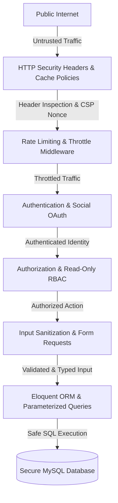

# Security

---

# Table of Contents

- [Security Overview](#security-overview)
- [Security Philosophy](#security-philosophy)
- [Defense in Depth](#defense-in-depth)
- [Authentication and Social Login](#authentication-and-social-login)
- [Authorization and Role-Based Access Control](#authorization-and-role-based-access-control)
- [Route Protection and Rate Limiting](#route-protection-and-rate-limiting)
- [Middleware-Based Access Control](#middleware-based-access-control)
- [HTTP Response Security Headers Policy](#http-response-security-headers-policy)
    - [Content Security Policy (CSP)](#content-security-policy-csp)
    - [Clickjacking Protection](#clickjacking-protection)
    - [HTTP Strict Transport Security (HSTS)](#http-strict-transport-security-hsts)
    - [Cross-Origin Isolation Policies](#cross-origin-isolation-policies)
    - [MIME-Type Sniffing Protection](#mime-type-sniffing-protection)
    - [Permissions and Feature Policy](#permissions-and-feature-policy)
    - [Strict Referrer Policy](#strict-referrer-policy)
- [Dynamic Route-Based Cache Control](#dynamic-route-based-cache-control)
- [CSRF and Session Security](#csrf-and-session-security)
- [Input Validation and Sanitization](#input-validation-and-sanitization)
- [SQL Injection and ORM Safety](#sql-injection-and-orm-safety)
- [XSS and Blade Template Escaping](#xss-and-blade-template-escaping)
- [Password Hashing and Credentials](#password-hashing-and-credentials)
- [Secure Stripe Payment Integration](#secure-stripe-payment-integration)
- [Secure File Upload Handling](#secure-file-upload-handling)
- [Soft Delete Strategy](#soft-delete-strategy)
- [Environment Secrets and Configuration](#environment-secrets-and-configuration)
- [Error Handling and Audit Logging](#error-handling-and-audit-logging)
- [Security Checklist](#security-checklist)
- [Security Summary](#security-summary)

---

# Security Overview

Security is a foundational design principle of Grace rather than an afterthought.

The application is engineered to protect customer data, administrative functionalities, financial transactions, and business assets through multiple independent security boundaries.

Instead of relying on a single defense line, Grace adopts a **Defense in Depth** strategy. If a single control is compromised or misconfigured, complementary security mechanisms ensure the overall integrity of the application remains uncompromised.

---

# Security Philosophy

Grace enforces several core principles throughout its codebase:

- **Secure by Default:** Every route, asset, and endpoint defaults to strict restriction unless explicitly designated as public.
- **Least Privilege:** Users, monitors, and administrators are granted the minimum level of access required to fulfill their functions.
- **Defense in Depth:** Security controls exist at the edge, HTTP response layer, middleware pipeline, domain controller level, and database storage.
- **Server-Side Trust Boundary:** Client input is treated as untrusted and strictly validated on the server.
- **Separation of Concerns:** Business logic, authorization rules, and security response policies operate independently in decoupled middleware and request abstractions.

---

# Defense in Depth

---

# Authentication and Social Login

Grace verifies identity before granting access to protected system resources.

## Standard Credentials
- **Email & Password:** Authenticated against encrypted password hashes using stateful session cookies.
- **Remember Me Tokens:** Cryptographically secure, long-lived tokens stored as hashed identifiers to prevent impersonation.

## Social Authentication (OAuth 2.0)
Grace integrates **Laravel Socialite** to enable single sign-on via third-party identity providers:
- **Google OAuth**
- **Facebook OAuth**
- **GitHub OAuth**

OAuth credentials eliminate local password storage for social users, reducing attack vectors related to password reuse.

---

# Authorization and Role-Based Access Control

Grace separates identity verification (*"Who are you?"*) from privilege assignment (*"What are you allowed to do?"*).

## Role Hierarchy
1. **Customers:** Restricted to personal profile management, cart/wishlist operations, review creation, and personal order tracking.
2. **Store Monitors (Read-Only Administrators):** Granted read-only visibility into the administrative dashboard, system reports, and inventory metrics. Forbidden from performing any write, update, or delete operations.
3. **Store Administrators:** Possess complete operational access across all catalog, inventory, customer, review, and configuration modules.

---

# Route Protection and Rate Limiting

Routes are grouped behind strict middleware guards in `routes/web.php`, `routes/admin.php`, and `routes/auth.php`.

### Rate Limiting (Throttling)
- **Login & Authentication:** Strictly throttled to mitigate brute-force password guessing attacks.
- **API & Dynamic Web Requests:** Rate-limited using IP and user keying to prevent Denial of Service (DoS) attacks and automated scraping.

---

# Middleware-Based Access Control

Requests traverse dedicated middleware classes prior to hitting controller methods.

- `auth`: Enforces active user sessions for protected areas.
- `guest`: Prevents authenticated users from reaching login or registration endpoints.
- `admin`: Verifies administrative privileges for management routes.
- `SecurityHeadersPolicy`: Applies hardening headers and Content Security Policies to every outbound HTTP response.

---

# HTTP Response Security Headers Policy

Grace implements a custom global middleware (`SecurityHeadersPolicy`) that injects hardening headers into every outgoing HTTP response.

## Content Security Policy (CSP)
Prevents malicious scripts, stylesheets, and iframe injections by strictly defining allowed source domains:
- **Dynamic Nonces (`nonce-$nonce`):** Every request generates a unique cryptographic nonce bound to inline execution contexts.
- **SHA-256 Hashes:** Pre-calculated style hashes enforce explicit validation of approved static assets.
- **Strict Directive Map:**
    - `default-src 'self'; frame-ancestors 'self';`
    - `$style_hashes = 'sha256-47DEQpj8HBSa+/......' 'sha256-3ITP0qhJJYBul......'`
    - `style-src-elem 'self' fonts.googleapis.com cdnjs.cloudflare.com cdn.jsdelivr.net unpkg.com www.gstatic.com 'nonce-$nonce' $style_hashes`
    - `style-src-attr 'unsafe-inline'`
    - `script-src 'self' cdnjs.cloudflare.com cdn.jsdelivr.net unpkg.com www.gstatic.com cdn.tiny.cloud 'nonce-$nonce'`
    - `font-src 'self' fonts.googleapis.com cdnjs.cloudflare.com cdn.jsdelivr.net unpkg.com fonts.gstatic.com data:`
    - `connect-src 'self' www.gstatic.com countries.dev api.emailjs.com cdnjs.cloudflare.com unpkg.com`
    - `img-src 'self' blob: data: cdn.jsdelivr.net unpkg.com flagcdn.com upload.wikimedia.org img.shields.io`

## Clickjacking Protection
- **`X-Frame-Options: DENY`**: Blocks browsers from embedding the site within HTML `<frame>`, `<iframe>`, `<embed>`, or `<object>` elements.
- **`frame-ancestors 'self'`**: Reinforces clickjacking protection within modern CSP supporting browsers.

## HTTP Strict Transport Security (HSTS)
- **`Strict-Transport-Security: max-age=31536000; includeSubDomains; preload`**: Forces browsers to communicate exclusively over HTTPS for a minimum of one year, including all subdomains.

## Cross-Origin Isolation Policies
Protects against side-channel attacks, data leakage across browser windows, and resource hijacking:
- **`Cross-Origin-Opener-Policy: same-origin` (COOP):** Isolates browsing context from cross-origin popups.
- **`Cross-Origin-Resource-Policy: same-origin` (CORP):** Blocks cross-origin resource reads.
- **`Cross-Origin-Embedder-Policy: credentialless` (COEP):** Allows loading third-party assets (CDNs, images) without exposing user credentials to cross-origin threats.

## MIME-Type Sniffing Protection
- **`X-Content-Type-Options: nosniff`**: Prevents browsers from guessing file MIME types, forcing adherence to declared `Content-Type` headers to prevent script execution via uploaded media files.

## Permissions and Feature Policy
- **`Permissions-Policy: geolocation=(), microphone=(), camera=(), payment=()`**: Completely disables browser access to hardware cameras, microphones, and location tracking APIs within the application context.

## Strict Referrer Policy
- **`Referrer-Policy: strict-origin-when-cross-origin`**: Ensures full referrer URLs are sent only during same-origin requests, stripping path information during cross-origin transfers.

---

# Dynamic Route-Based Cache Control

To balance client performance with user data privacy, `SecurityHeadersPolicy` dynamically alters caching strategy based on route sensitivity:

- **Public Routes (Home, Catalog, Payment Page, Public Views):**
    - Sends `Cache-Control: no-cache, private, must-revalidate` to preserve browser **Back-Forward Cache (bfcache)** for instantaneous navigation.
- **Private/Sensitive Routes (Admin Dashboard, Customer Profile, Cart, Orders):**
    - Sends `Cache-Control: no-store, no-cache, must-revalidate, max-age=0` to guarantee that browser caches never store sensitive customer or business data.

---

# CSRF and Session Security

## CSRF Protection
Every state-changing HTTP request (`POST`, `PUT`, `PATCH`, `DELETE`) is verified against a unique, session-bound CSRF token via Laravel's middleware. Unauthenticated third-party submissions are rejected with a `419 Page Expired` status code.

## Session Hardening
- **Session Regeneration:** Active session IDs are regenerated upon user login and logout to defeat **Session Fixation** attacks.
- **HttpOnly & Secure Cookies:** Authentication cookies are configured to prevent access via JavaScript (`HttpOnly`) and are transmitted over encrypted HTTPS connections (`Secure`).

---

# Input Validation and Sanitization

All incoming parameters are validated through dedicated Laravel **Form Request** classes before reaching domain logic.

- Rules enforce strict data typing, length caps, pattern matching, array validations, and database existence checks.
- String parameters are trimmed and sanitized to strip invisible characters and control sequences.

---

# SQL Injection and ORM Safety

Database operations are executed through **Laravel Eloquent ORM** and PDO parameter binding.

- SQL query construction uses bound placeholders (`?` or `:name`), rendering SQL injection attacks impossible under standard operations.
- Dynamic raw queries (`DB::raw`) are avoided or restricted to strictly sanitized internal control structures.

---

# XSS and Blade Template Escaping

Cross-Site Scripting (XSS) is mitigated by default through Laravel Blade:

- All output tags (`{{ $variable }}`) automatically pass string values through `htmlspecialchars()` before output rendering.
- Unescaped syntax (`{!! $variable !!}`) is restricted to controlled, pre-sanitized trusted outputs (such as HTML formatted markdown rendering).

---

# Password Hashing and Credentials

User passwords are hashed using **Bcrypt / Argon2id** with variable work factors:

- One-way cryptographic hashing ensures raw passwords are never readable in plain text.
- Password hashes automatically incorporate random salts to render pre-computed **Rainbow Table** attacks ineffective.

---

# Secure Stripe Payment Integration

Grace integrates **Stripe API** for payment processing without handling raw credit card data on application servers:

- Client-side tokenization ensures payment details pass directly from the customer's browser to Stripe's PCI-DSS compliant infrastructure.
- Payment status updates are confirmed via server-side webhook signature verification to prevent price or status tampering.

---

# Secure File Upload Handling

Media files uploaded to the catalog are validated against strict server-side rules:

- **MIME Type Validation:** Checked against approved image extensions (`jpeg`, `png`, `webp`).
- **File Size Caps:** Strict file size thresholds prevent disk-exhaustion attacks.
- **Filename Sanitization:** Uploaded files are renamed using cryptographically secure UUIDs/hashes to prevent path traversal (`../`) and file overwrite vulnerability vectors.

---

# Soft Delete Strategy

Sensitive core entities (Categories, Subcategories, Products, Users, Orders, Reviews) utilize Laravel's `SoftDeletes` behavior:

- Record deletion marks a timestamp (`deleted_at`) rather than removing rows from physical storage.
- Prevents accidental data loss, allows administrative auditing, and maintains relational integrity across historical transactions.

---

# Environment Secrets and Configuration

Sensitive credentials (API keys, database passwords, OAuth secrets) are managed strictly outside source control:

- Application secrets reside in local `.env` configuration files.
- The `.env` file is explicitly ignored by `.gitignore`.
- Production deployments read environment variables from host process managers to prevent secret leaks via code repositories.

---

# Error Handling and Audit Logging

To prevent information disclosure:

- **Production Mode (`APP_DEBUG=false`):** Suppresses technical stack traces, database schemas, and line numbers from end users, returning clean HTTP error pages (`404`, `403`, `500`).
- **Application Logging:** Detailed exceptions and error traces are logged to secure local log files for administrative troubleshooting.

---

# Security Checklist

| Security Control            | Implementation Details                                                          | Status |
|:----------------------------|:--------------------------------------------------------------------------------|:------:|
| **Authentication**          | Session Guards, Remember Tokens, OAuth 2.0 (Google, Facebook, GitHub)           |   ✅    |
| **Authorization**           | Middleware-based RBAC (Customers, Read-Only Store Monitors, Admins)             |   ✅    |
| **Password Hashing**        | Bcrypt / Argon2id salted key derivation                                         |   ✅    |
| **Request Validation**      | Encapsulated Form Request classes with strict type checking                     |   ✅    |
| **Input Sanitization**      | Automatic string trimming and payload sanitization                              |   ✅    |
| **CSRF Protection**         | Unique session-bound tokens on all mutating HTTP methods                        |   ✅    |
| **SQL Injection**           | Parameterized PDO statements via Eloquent ORM                                   |   ✅    |
| **XSS Protection**          | HTML escaping via Blade `{{ }}` + Dynamic CSP Nonces                            |   ✅    |
| **Content Security Policy** | Dynamic nonces, asset source restrictions, hash validation                      |   ✅    |
| **Clickjacking Protection** | `X-Frame-Options: DENY` & CSP `frame-ancestors 'self'`                          |   ✅    |
| **HSTS Enforcement**        | `Strict-Transport-Security` (31536000s, subdomains, preload)                    |   ✅    |
| **Cross-Origin Isolation**  | `COOP: same-origin`, `CORP: same-origin`, `COEP: credentialless`                |   ✅    |
| **MIME Sniff Protection**   | `X-Content-Type-Options: nosniff`                                               |   ✅    |
| **Permissions Policy**      | Hardware access blocked (camera, mic, geolocation)                              |   ✅    |
| **Strict Referrer Policy**  | `strict-origin-when-cross-origin`                                               |   ✅    |
| **Route-Based Caching**     | Private/sensitive routes block caching (`no-store`), public routes keep bfcache |   ✅    |
| **Rate Limiting**           | Throttling applied to authentication endpoints and dynamic routes               |   ✅    |
| **Payment Handling**        | PCI-DSS compliant Stripe client tokenization & webhook signatures               |   ✅    |
| **File Upload Security**    | MIME inspection, size limits, and UUID filename renames                         |   ✅    |
| **Soft Delete Strategy**    | Auditability and transactional safety via `deleted_at` timestamps               |   ✅    |
| **Secrets Management**      | `.env` separation isolated from version control                                 |   ✅    |
| **Error Handling**          | Debug details masked on production; local error logging                         |   ✅    |

---

# Security Summary

Grace adopts a security model that combines Laravel's core framework capabilities with custom architectural controls.

By integrating custom security headers, strict authorization bounds, input sanitization, and payment isolation across every phase of the request lifecycle, Grace guarantees a protected environment for customer data and administrative operations.

---

# Continue Reading

➡ **[Performance](./performance)**
